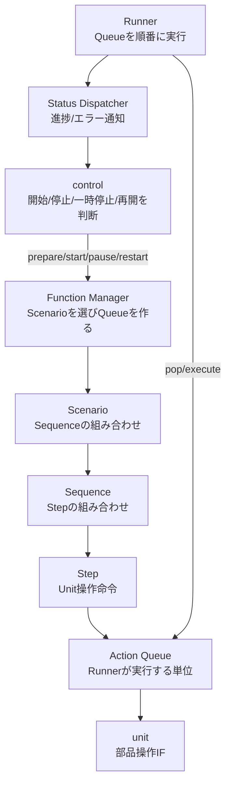
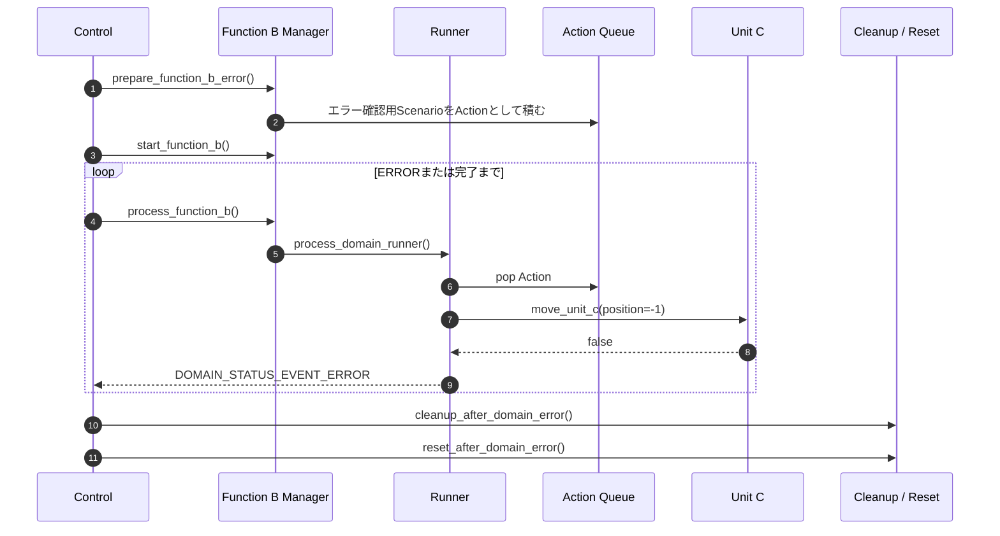

# C Workflow Sample

`Scenario > Sequence > Step` の階層と、Action Queue / Runnerによる実行制御をC言語で示すサンプルです。

このサンプルでは、上位の `control` が機能を開始し、`domain` がScenarioをAction Queueへ展開し、RunnerがActionを順番に実行します。
各Actionの最終的な実行先は `unit` です。

## 最初に読む順番

まずは次の順番で読むと、責務の分かれ方を追いやすくなります。

1. `src/unit/README.md`
2. `src/domain/README.md`
3. `src/domain/common/README.md`
4. `src/domain/functionA/README.md`
5. `src/domain/functionB/README.md`
6. `src/control/README.md`

`unit` から読む理由は、最終的に呼ばれる関数が単純で見通しやすいからです。
そのあとに `domain` を読むと、StepがどのUnit操作へつながるかを理解しやすくなります。

## 全体像



## 正常系と異常系

正常系では、ControlがFunction Aを開始し、Runner threadがAction Queueを最後まで実行します。
途中でControl threadからpause/restartを呼び、現在のActionが終わったあとに一時停止と再開が反映されることを確認できます。

異常系では、Function Bのエラー確認用Scenarioを使います。
Unit Cへ負の移動先を渡すStepを入れてあり、`move_unit_c()` が `false` を返します。
RunnerはそのActionでERRORへ遷移し、Controlへ `domain_status_report_t` を通知します。
Controlは通知に含まれるScenario名、Sequence名、Step名、Action名を見て、清掃処理とリセット処理へ進みます。



## ビルドと実行

ルートディレクトリで実行します。

```bash
make
```

正常系のControlサンプルを実行します。

```bash
make run-control
```

異常系のControlサンプルを実行します。

```bash
make run-control-error
```

すべての確認用プログラムを実行します。

```bash
make test
```

各Unit操作には1秒の待ち時間を入れているため、`make test` は少し時間がかかります。

## ログの見方

正常系では、次のような進捗ログが出ます。

```text
progress=3/11
event=ACTION_COMPLETED
step=move Unit A to 100
```

`progress=3/11` は、Scenarioから展開された11個のActionのうち3番目まで進んだことを表します。

異常系では、次の情報に注目します。

```text
event=ERROR
scenario=Function B error scenario
sequence=Function B error sequence
step=move Unit C to invalid position
```

RunnerはUnitの種類や具体的な処理内容を知りません。
Actionを実行し、戻り値が `false` であればERRORへ遷移し、Contextとして持っている名前や進捗情報をControlへ通知します。

## このサンプルで意識する境界

`control` は、機能をいつ動かすかを決めます。

`domain` は、どのScenarioを使い、どのStepをどの順番で実行するかを管理します。

`unit` は、実際の部品操作IFを提供します。

この3つを分けることで、上位制御、ワークフロー、部品操作の変更範囲を分離できます。
