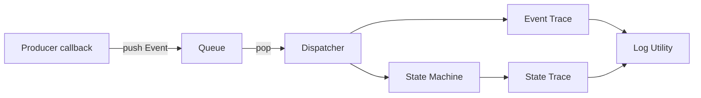
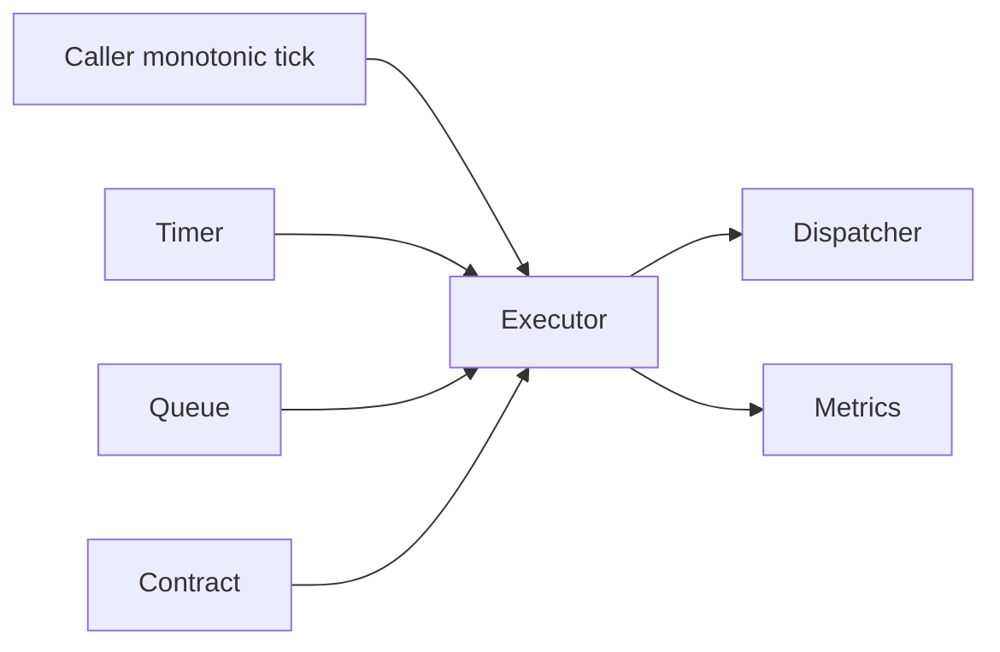
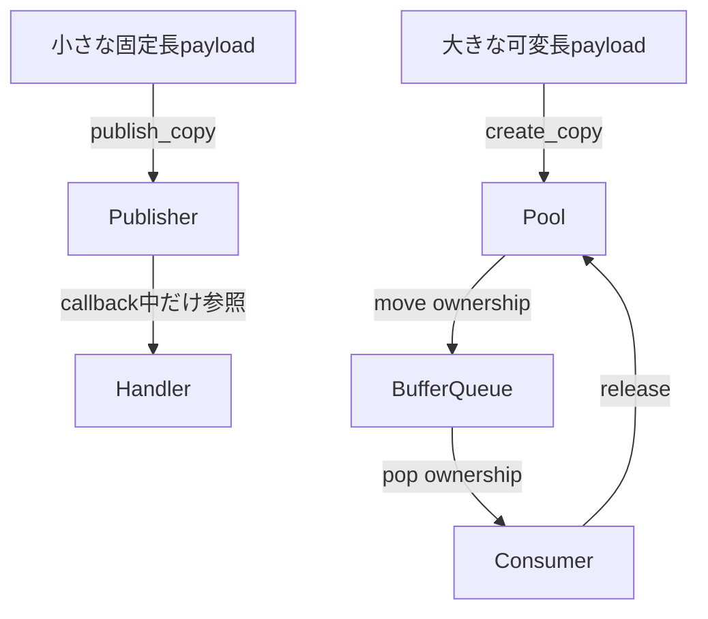

# Event Utility Examples

Event Utilityの代表的な組み立て方を、3つの実行可能なサンプルで示す。
個別APIを単独で並べるのではなく、実際によく使う接続単位でまとめている。

## サンプル一覧

| サンプル | 主なAPI | 用途 |
| --- | --- | --- |
| `state_machine_dispatch.c` | Queue、Dispatcher、State Machine、Trace | 非同期producerの通知から状態を進める |
| `scheduled_executor.c` | Timer、Contract、Executor、Metrics | 周期Event Loopをbudget付きで動かす |
| `payload_lifecycle.c` | Publisher、Buffer Pool Envelope | 小payloadの値copyと大payloadの所有権移動 |

```sh
make utility-event-examples
```

## 1. Event配送と状態遷移

[`state_machine_dispatch.c`](state_machine_dispatch.c)は、非同期producerの完了通知を
Queueへ積み、単一のEvent LoopでDispatcherからState Machineへ渡す。



重要なのは、producer callbackからState Machineを直接変更しないことである。
状態遷移、entry、exit、actionは`ut_event_dispatch()`を呼んだEvent Loop上で同期実行
されるため、共有状態を更新する実行contextを一つに集約できる。

この例では`peek`で次Eventを確認してから`pop`している。通常処理で確認が不要なら
`pop`だけでよい。`clear`はQueueを破棄するときに残件を捨てる用途で使う。

## 2. Timer付きEvent Loop

[`scheduled_executor.c`](scheduled_executor.c)は、Timer Scheduler、payload Contract、
Dispatcher、MetricsをExecutorへ接続する。



Executor自身はthread、clock、sleepを持たない。呼出側のloopまたはtaskが現在tickと
1回の処理上限`event_budget`を渡す。これにより、Eventが多い場合でも他処理へ制御を
戻す時点を呼出側が決められる。

- `Timer`: one-shot、periodic、restart、cancelを提供する。
- `Contract`: Event IDごとのpayload sizeと所有方式を検証する。
- `Metrics`: Queue最大深度、拒否、未処理、budget到達などを飽和counterで記録する。
- `Executor report`: その1回だけの結果。Metricsは起動後の累積値。

## 3. Payloadの寿命

[`payload_lifecycle.c`](payload_lifecycle.c)はpayload sizeで方式を分ける。



- 小payloadはPublisherの固定長slotへ値copyする。発行元stackの寿命から切り離せる。
- 大payloadはBuffer Poolへ格納し、Envelope Queueでhandle所有権をmoveする。
- `push_move`成功後、producerはreleaseしない。
- `pop_move`成功後、consumerが必ずreleaseする。
- Publisherのhandlerはpayload pointerをcallback終了後まで保持しない。

複数producerからPublisherへ発行する場合は、利用OSのMutexを
`lock`/`unlock` callbackとして初期化時に渡す。DispatcherとState Machineも内部threadを
持たないため、同じcontextへの並行操作は呼出側で直列化する。

## API対応表

| 機能 | サンプル内の確認箇所 |
| --- | --- |
| Queue `init/push/peek/pop/count` | `state_machine_dispatch.c` |
| Dispatcher `subscribe/dispatch`、ANY購読 | `state_machine_dispatch.c` |
| State Machine、entry、遷移Trace | `state_machine_dispatch.c` |
| Event TraceとLog adapter | `state_machine_dispatch.c` |
| Timer `start/restart/cancel/next_deadline` | `scheduled_executor.c` |
| Contract Registry | `scheduled_executor.c` |
| Executorとbudget report | `scheduled_executor.c` |
| Metrics `snapshot/reset` | `scheduled_executor.c` |
| Publisher `publish_copy/dispatch/count` | `payload_lifecycle.c` |
| Buffer message `create/read/release` | `payload_lifecycle.c` |
| Buffer Queue `push_move/pop_move/release_all` | `payload_lifecycle.c` |

エラー系、満杯、再入拒否、解除APIなどの全分岐は`tests/`の単体テストを参照する。
