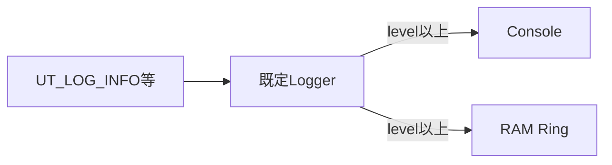
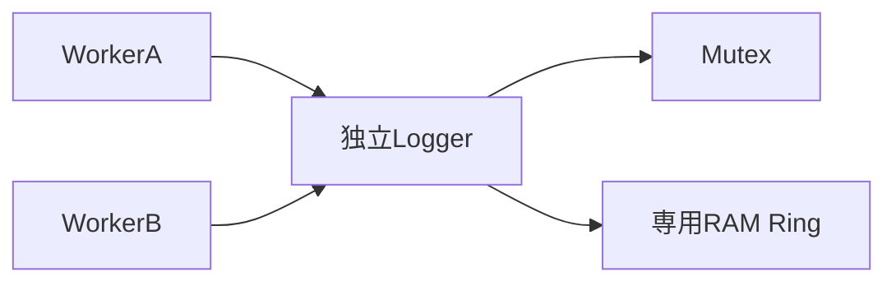

# Log Foundation Examples

Log Foundationの代表的な3パターンを、実行可能なサンプルとしてまとめる。

| サンプル | 用途 |
| --- | --- |
| `basic_default_logger.c` | Application全体の既定Loggerとlevel macro |
| `ring_maintenance.c` | RAM Ringのread、dump、clear |
| `thread_safe_logger.c` | 独立Loggerを複数threadから共有 |

```sh
make foundation-log-examples
```

## 1. Application既定Logger

[`basic_default_logger.c`](basic_default_logger.c)では起動時に
`ut_log_initialize()`を1回呼び、通常コードから`UT_LOG_INFO`等のmacroを使用する。



ConsoleとRingは別々の最低levelを持つ。たとえば開発中はConsoleを`DEBUG`、運用中は
`ERROR`へ変更しつつ、Ringには`INFO`以上を残せる。無効levelのmacroはformat引数を
評価しない。

Loggerはmessage、module、file、functionを固定長Recordへcopyする。呼出元文字列の
pointer寿命には依存しない。`ut_log_shutdown()`はLogを使うthreadを停止した後に呼ぶ。

## 2. RAM Ringの読出し

[`ring_maintenance.c`](ring_maintenance.c)ではConsoleを無効にし、診断Recordだけを
固定長Ringへ蓄積する。

- Ring満杯時は最古Recordを上書きする。
- `ut_log_read()`は最古Recordをindex 0として1件copyする。
- `ut_log_dump()`は古い順にcallbackへ渡す。
- dump callbackから同じLogger APIを呼ばない。
- `ut_log_clear()`後もsequenceと上書き累積数は維持する。

任意の出力先への送信や再試行はLog Foundationではなく、dump callbackを所有する
外部consumerの責務である。

## 3. 複数threadと独立Logger

[`thread_safe_logger.c`](thread_safe_logger.c)は`ut_logger_init()`で独立Loggerを作り、
pthread Mutexを`lock`/`unlock` callbackとして渡す。



独立Loggerは、Application既定Logと診断用途別のRingを分けたい場合に使う。
Log FoundationはOS Mutexを生成・破棄しないため、その寿命は利用側が管理する。
`ut_logger_dump()`は排他を保持してcallbackを呼ぶので、callbackから同じLoggerへ
書き戻すとdeadlockの原因になる。

## API対応表

| 機能 | サンプル |
| --- | --- |
| `ut_log_initialize/shutdown`とlevel macro | `basic_default_logger.c` |
| Console/Ringの実行時設定 | `basic_default_logger.c` |
| clock callbackとConsole adapter | `basic_default_logger.c` |
| count、overwritten count、read、dump、clear | `ring_maintenance.c` |
| `ut_logger_init`と明示Logger書込み | `thread_safe_logger.c` |
| lock/unlock callback | `thread_safe_logger.c` |

不正引数、Console出力失敗、途中dump停止などの全分岐は`tests/`で検証している。
