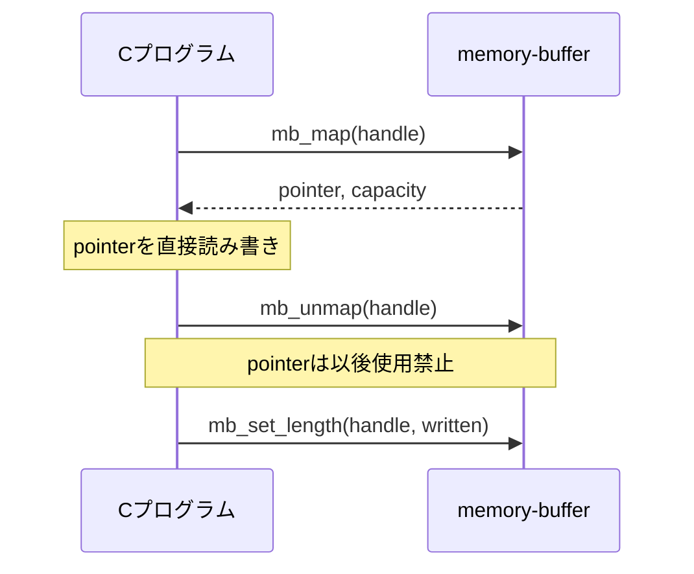

# C経験者向け はじめてのMemory Buffer

この文書は、Cを1年から2年ほど経験している人が、Rustやメモリ管理用語を
詳しく知らなくても`memory-buffer`を使い始められるように説明する。

最初からRustの実装を読む必要はない。Cのheaderと関数だけで利用できる。

## まず何をするライブラリか

Cで可変長データを保存する場合、通常は次のような管理が必要になる。

- どのメモリが空いているか探す
- 他のデータと領域が重ならないようにする
- 読み書きが確保範囲を越えていないか確認する
- 解放済みのポインタを再利用しない
- 使用中のメモリを誤って解放しない

`memory-buffer`は、この管理をまとめて引き受ける。


C側は実際の保存場所を普段は意識せず、ライブラリから受け取った
`handle`という番号を使って読み書きする。

## mallocとの違い

`malloc`は必要になった時点でheapからメモリを確保する。
このライブラリでは、最初にC側が大きな配列を1つ用意し、その中を分割して使う。

```c
static uint8_t arena[4096];
```

```text
arena全体 4096 byte

+-------------+----------+----------------+------------------+
| buffer A    | 空き     | buffer B       | 空き             |
| 100 byte    |          | 256 byte       |                  |
+-------------+----------+----------------+------------------+
```

この方式には次の特徴がある。

- 実行中にOSやheap allocatorを必要としない
- 使用可能なメモリ量を事前に決められる
- 確保した領域が互いに重ならないようライブラリが管理する
- arenaが足りなければ`MB_OUT_OF_MEMORY`を返す

## 最初に覚える3つ

### 1. arena

実データを保存するbyte配列である。

```c
static uint8_t arena[4096];
```

arenaのサイズが、この管理単位で保存できるデータ量の上限になる。

### 2. context

arenaの管理情報を保存する変数である。

```c
static mb_context_t context;
```

contextには「どこが使用中か」「どのhandleが有効か」などが入る。
中身はライブラリ専用なので、C側からfieldを読むことはできない。

contextとarenaを1組にしたものが「1 context」である。

```text
1 context

+----------------------+      +---------------------------+
| mb_context_t         |      | uint8_t arena[]           |
| 空き場所やhandle管理 | ---> | 実際のデータを保存        |
+----------------------+      +---------------------------+
```

### 3. handle

確保したbufferを識別する番号である。

```c
mb_handle_t handle;
```

pointerの代わりにhandleを使うことで、解放済みbufferへの操作をライブラリが
検出できる。handleの数値やbit配置には意味を持たせず、そのままAPIへ渡す。

## 基本の流れ

最初は次の5関数だけ覚えればよい。


## 最小サンプル

```c
#include "memory_buffer.h"

#include <assert.h>
#include <stdint.h>
#include <string.h>

static mb_context_t context;
static uint8_t arena[4096];

int main(void)
{
    const uint8_t input[] = {0x10, 0x20, 0x30, 0x40};
    uint8_t output[sizeof(input)] = {0};
    mb_handle_t handle;

    /* contextとarenaを関連付ける。 */
    assert(mb_init(
        &context,
        sizeof(context),
        arena,
        sizeof(arena)) == MB_OK);

    /* arena内に16 byteのbufferを確保する。 */
    assert(mb_alloc(&context, 16u, &handle) == MB_OK);

    /* bufferの先頭からinputを書き込む。 */
    assert(mb_write(
        &context,
        handle,
        0u,
        input,
        sizeof(input)) == MB_OK);

    /* bufferの先頭からoutputへ読み出す。 */
    assert(mb_read(
        &context,
        handle,
        0u,
        output,
        sizeof(output)) == MB_OK);

    assert(memcmp(input, output, sizeof(input)) == 0);

    /* 不要になったbufferを解放する。 */
    assert(mb_free(&context, handle) == MB_OK);

    return 0;
}
```

実際の処理では`assert`だけにせず、各戻り値に応じたerror処理を行う。

## capacityとlength

bufferには2種類の大きさがある。

| 名前 | 意味 |
| --- | --- |
| capacity | `mb_alloc`で予約した最大サイズ |
| length | 現在、有効なデータが入っているサイズ |

16 byte確保し、4 byte書き込んだ場合:

```text
capacity = 16
length   = 4

+----------------+----------------------------------------------+
| 有効な4 byte   | まだ有効なデータとして扱わない12 byte       |
+----------------+----------------------------------------------+
```

`mb_write`は書き込んだ位置までlengthを伸ばす。`mb_read`はcapacity内であっても、
lengthを越える範囲を読もうとすると`MB_OUT_OF_BOUNDS`を返す。

現在値は`mb_get_info`で確認できる。

```c
mb_buffer_info_t info;

if (mb_get_info(&context, handle, &info) == MB_OK) {
    /* info.lengthとinfo.capacityを使用できる。 */
}
```

## handleを解放した後

`mb_free`に成功したhandleは無効になる。

```c
mb_free(&context, handle);

/* このhandleはもう使ってはいけない。 */
mb_read(&context, handle, 0u, output, sizeof(output));
```

最後の`mb_read`は`MB_INVALID_HANDLE`になる。同じ管理slotが別bufferへ再利用されても、
古いhandleで新しいbufferを操作できないように世代番号を内部で管理している。

```text
最初のhandle          free後             次のhandle
[slot 3, 世代 1]  ->  無効        ->    [slot 3, 世代 2]

slot番号が同じでも世代が違うため、古いhandleは拒否される。
```

## 主な戻り値

すべてのAPIは`mb_result_t`を返す。

| 戻り値 | 初心者向けの意味 |
| --- | --- |
| `MB_OK` | 成功 |
| `MB_INVALID_ARGUMENT` | nullや0 byteなど、引数が不正 |
| `MB_NOT_INITIALIZED` | `mb_init`していない |
| `MB_OUT_OF_MEMORY` | arenaの空き、または管理slotが足りない |
| `MB_INVALID_HANDLE` | 解放済み、reset済み、または不正なhandle |
| `MB_OUT_OF_BOUNDS` | 読み書き範囲がbufferを越えている |
| `MB_BUSY` | pointerを直接貸出中なので操作できない |

戻り値を無視すると、不具合の原因が分からなくなる。少なくともerrorを記録し、
後続処理を続けてよいか判断する。

## mapは必要になるまで使わない

`mb_read`と`mb_write`はデータをcopyするため、使い方が単純で範囲検査も行われる。
まずはこちらを使う。

どうしてもcopyを避けたい場合だけ`mb_map`を使う。`mb_map`はbufferの実pointerを
一時的に借りる操作である。



```c
uint8_t *data;
size_t capacity;

if (mb_map(&context, handle, &data, &capacity) == MB_OK) {
    size_t written = fill_buffer(data, capacity);

    /* dataを使う全処理を終了してから返す。 */
    mb_unmap(&context, handle);

    /* 実際に初期化した範囲を有効なデータ長にする。 */
    mb_set_length(&context, handle, written);
}
```

map中は同じbufferへの`mb_read`、`mb_write`、`mb_free`などが`MB_BUSY`になる。
`mb_unmap`後に`data`を使用してはいけない。

## 複数threadで使う場合

ライブラリ内部にlockはない。同じcontextを複数threadで使う場合は、呼出側で
mutexなどを使い、API callが同時に実行されないようにする。

```text
安全:
Thread A ----[ lock -> API call -> unlock ]----
Thread B --------------------------------------[ lock -> API call -> unlock ]

危険:
Thread A ----[ API call ]----
Thread B ------[ API call ]----  同じcontextへ同時access
```

異なるcontextは独立している。

## よくある間違い

### `mb_init`する前にAPIを呼ぶ

`MB_NOT_INITIALIZED`になる。最初に必ずcontextとarenaを関連付ける。

### free後のhandleを使う

`MB_INVALID_HANDLE`になる。freeに成功した時点でhandleを無効として扱う。

### capacityとlengthを混同する

capacityは予約サイズ、lengthは有効データサイズである。読めるのはlengthまで。

### mapしたpointerをunmap後も使う

禁止されている。pointerは`mb_map`から`mb_unmap`までの間だけ有効と考える。

### 同じcontextを複数threadから同時に操作する

内部lockはない。呼出側で直列化する。

### freeやresetでデータが0クリアされると思う

arenaのbyteは消去されない。秘密情報を扱う場合は、必要な消去処理を呼出側で行う。

## 用語集

| 用語 | この文書での意味 |
| --- | --- |
| buffer | 1つのデータ保存領域 |
| arena | 複数bufferの保存元になる大きなbyte配列 |
| context | arenaの空き領域やhandleを管理する情報 |
| handle | bufferを識別する番号 |
| opaque | 中身を利用者に公開せず、専用APIだけで操作する設計 |
| capacity | bufferへ保存できる最大byte数 |
| length | 現在有効なデータのbyte数 |
| map | bufferの実pointerを一時的に借りる操作 |
| ABI | CとRustのコンパイル済みコードが関数や型を受け渡す規約 |
| `no_std` | Rustの標準libraryやOS機能へ依存しないbuild方式 |

## 次に読む資料

1. 動くCコードを見る:
   [`examples/c_usage.c`](examples/c_usage.c)
2. 実際の利用パターンを確認する:
   [使い方](docs/usage.md)
3. 全APIの戻り値と契約を調べる:
   [C API仕様](docs/api.md)
4. 内部構造を理解する:
   [構成と責務](docs/architecture.md)
5. buildとtestを実行する:
   [高度検証](docs/advanced-verification.md)

最初の段階ではRust実装、Miri、fuzz、ABI生成の詳細まで理解する必要はない。
基本APIを安全に使えるようになってから、品質検証の資料へ進めばよい。
