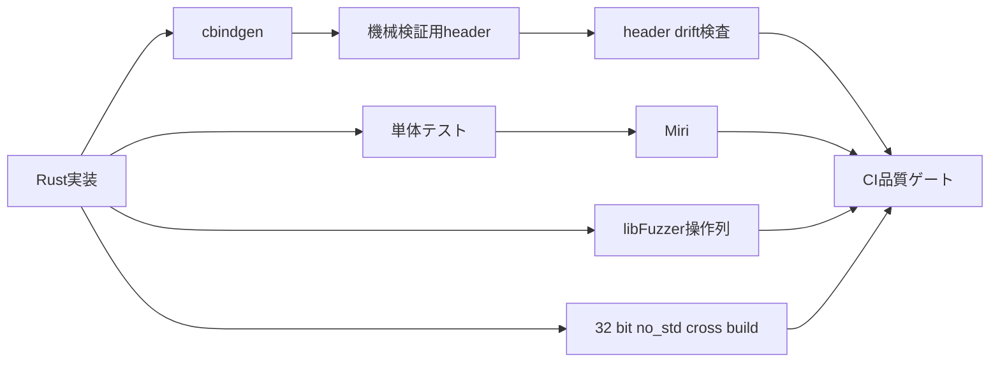

# 高度検証

## 目的

通常の単体・結合テストだけでは見つけにくいFFIの型差異、未定義動作、
任意操作列の不具合、hostと異なるtarget固有のbuild failureを早期に検出する。

この文書は、追加した検証機構の役割、実行方法、導入時に実際に検出した問題を
後から追跡できるように記録する。

## 検証構成



| 機構 | 主な検出対象 | Make target |
|---|---|---|
| cbindgen | Rust公開ABIと生成headerの差分 | `make header-check` |
| Miri | Rustの未定義動作、pointer provenance、alias違反 | `make miri` |
| cargo-fuzz | API操作順、境界値、状態遷移の組合せ不具合 | `make fuzz-smoke` |
| cross build | target依存の型幅、`no_std`、ABI、移植性 | `make portable-check` |

通常の品質ゲートは`make check`、上記をすべて含むmerge前検査は
`make extended-check`で実行する。

## cbindgen

設定は`cbindgen.toml`、生成物は
`include/memory_buffer_generated.h`に置く。

```sh
make header
make header-check
```

- `make header`はRust公開定義から機械検証用headerを再生成する
- `make header-check`は生成結果とrepository内のheaderが一致するか検査する
- 生成headerは直接編集しない

外部利用者がincludeする正式な仕様headerは`include/memory_buffer.h`である。
このheaderはopaqueな`mb_context_t`、Doxygenコメント、利用者向け名称を提供する。
生成headerはRust側の関数シグネチャと型を機械的に監視するABI manifestとして使う。
正式header側のsize、alignment、field offsetはC/Rust双方のcompile-time assertionと
C結合テストでも検証する。

## Miri

固定nightlyでlibraryの単体テストをMiri上で実行する。

```sh
make miri
```

Miriは通常のCPU実行で偶然動くコードも、Rustのmemory modelに基づいて検査する。
本libraryでは特に次を対象とする。

- raw pointerの由来と有効期間
- mutable aliasの競合
- 解放後access
- alignment違反
- 未初期化memoryの参照

### 導入時に検出した問題

初回実行で、テストfixtureが`Box`内arenaへのraw pointerをcontextへ保存した後、
その`Box`をtupleとして返していたため、返却時のretagで保存済みpointerの由来が
無効になる問題を検出した。

fixtureをraw pointerで所有し、`Drop`時に`Box`へ戻す専用型へ変更した。
これは製品APIの不具合ではなくテストfixtureの問題だったが、通常テストでは
検出できないpointer provenance違反をMiriが検出できることを確認した。

## Fuzz

`fuzz/fuzz_targets/operation_sequence.rs`は入力byte列をAPI操作列として解釈し、
次の操作をランダムな順番と値で実行する。

- alloc、free
- read、write
- set length
- map、unmap
- info取得
- reset

短時間の回帰確認:

```sh
make fuzz-smoke
```

現在のsmoke条件は最大入力長4096 byte、2000回である。導入時の2000回実行では
crashとassertion failureは発生しなかった。

local実行環境が`ptrace`配下の場合、LeakSanitizer自体が終了時に失敗するため、
`make fuzz-smoke`では`ASAN_OPTIONS=detect_leaks=0`を指定する。libFuzzerと
AddressSanitizerによる操作列、範囲外access、use-after-freeなどの検査は継続する。
leak検査は別途、`ptrace`を使用しないsanitizer jobを追加して担保する。

長時間検証では回数制限を外すか、時間を指定する。

```sh
cargo +nightly-2026-06-06 fuzz run operation_sequence \
  --fuzz-dir memory-buffer/fuzz -- -max_total_time=3600 -max_len=4096
```

crash入力は`memory-buffer/fuzz/artifacts`、学習corpusは
`memory-buffer/fuzz/corpus`に生成される。
不具合を検出した場合は、最小化した入力を通常のregression testへ移植する。

## `no_std` Cross Build

hostとはpointer幅が異なる代表targetとして`thumbv7em-none-eabi`へrelease
buildする。特定用途への対応を意味するものではなく、OSや`std`への意図しない
依存とtarget依存ABIを検出するための移植性検査である。

```sh
make portable-check
```

別targetを検査する場合:

```sh
make portable-check PORTABLE_TARGET=<target-triple>
```

### 導入時に検出した問題

hostでは4 byteだったRustの`#[repr(C)]` result enumが、Thumb targetでは
異なるsizeとして扱われ、compile-time ABI assertionが失敗した。

result型をRustでは`#[repr(u32)]`、Cでは`uint32_t`へ固定した。これにより
compilerやtargetのenum ABI optionへ依存せず、result codeを常に32 bitで渡す。

### 現在の保証範囲

この検査が保証するのは、固定stable toolchainによる`no_std` cross compileまで
である。次は利用側のbuildと実行環境で検証する。

- 最終binaryへのlink
- 対象環境での実行test
- threadや非同期処理との同期
- 対象memoryの属性、alignment、cache制御
- target固有のalignmentとmemory region制約

## CI

`.github/workflows/ci.yml`はpushとpull requestで
`make extended-check cppcheck`を実行する。使用するRust toolchainと各tool versionは
固定し、HTML品質レポートをartifactとして保存する。

| Tool | 固定version |
|---|---|
| Rust stable | `1.96.0` |
| Rust nightly | `nightly-2026-06-06` |
| cbindgen | `0.29.3` |
| cargo-fuzz | `0.13.1` |
| cargo-llvm-cov | `0.8.7` |
| rust-code-analysis-cli | `0.0.25` |

tool更新時はversionだけを先行変更せず、`make extended-check cppcheck`の結果と
生成header、coverage、CC、MIの変化を同じ変更内で確認する。
