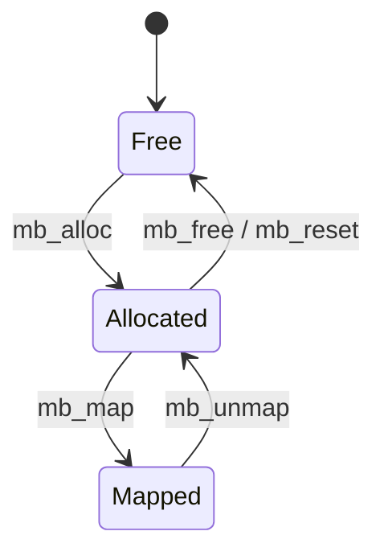

# 外部提供用C API仕様

## 適用範囲

この文書は`include/memory_buffer.h`で公開するC ABIの契約を定義する。
実装ファイルやRust内部型は外部仕様に含まない。

`include/memory_buffer_generated.h`は`cbindgen`で生成する機械検証用ABI manifest
であり、直接編集しない。外部利用者は説明とopaque contextを含む
`memory_buffer.h`をincludeする。

## ABI

| 項目 | 値 |
|---|---:|
| ABI version | `MB_ABI_VERSION` (`1.0`) |
| handle型 | `uint32_t` |
| context size | `MB_CONTEXT_SIZE` (`4096`) |
| context alignment | `MB_CONTEXT_ALIGNMENT` (`8`) |
| 同時buffer数 | `MB_MAX_BUFFERS` (`64`) |

`mb_result_t`はtargetのenum ABIに依存しない`uint32_t`とする。
`mb_result_t`、`mb_buffer_info_t`のsizeとfield offsetは、C headerとRust実装の
双方でcompile-time assertionにより検証する。

## 共通契約

- 1つのcontextへのAPI callは呼出側で直列化する
- taskと割り込みから同じcontextへ同時accessしない
- `mb_init`前は`mb_init`以外を呼ばない
- context、arena、map pointerはlibraryが要求する期間中有効に保つ
- context storageとarenaを重複させない
- 出力引数のmemoryをcontext storageと重複させない
- APIが返すhandleのbit layoutを解釈しない
- `MB_OK`以外の場合、出力引数の値を使用しない
- `mb_init`による再初期化前に、以前のhandleとmap pointerの利用者を停止する

## Result code

| Result | 意味 |
|---|---|
| `MB_OK` | 成功 |
| `MB_INVALID_ARGUMENT` | null、0 byte要求、alignment、sizeなどの引数違反 |
| `MB_NOT_INITIALIZED` | `mb_init`済みではないcontext |
| `MB_OUT_OF_MEMORY` | arena空き不足または64 slot使用済み |
| `MB_INVALID_HANDLE` | 形式不正、解放済み、reset済み、世代不一致のhandle |
| `MB_OUT_OF_BOUNDS` | capacityまたは論理長を越える範囲 |
| `MB_BUSY` | map貸出中のため実行できない操作 |

数値`3`は将来互換用に予約し、現在のresult codeとして使用しない。

## 所有権モデル

- contextとarenaの所有権は常に呼出側にある
- allocated bufferの生存期間はhandleで管理する
- map pointerは`mb_unmap`までの排他的貸出である
- map中の再map、read、write、length変更、free、resetは`MB_BUSY`になる
- `mb_unmap`前にDMA、割り込み、callbackを含む全pointer利用者を停止する

## API一覧

### `mb_init`

contextを初期化し、arenaと関連付ける。未初期化storageへ使用できる。
再初期化時は以前のhandleをすべて破棄する。

成功: `MB_OK`

失敗: `MB_INVALID_ARGUMENT`

### `mb_reset`

全bufferを解放し、全handleを無効化する。arena本体は消去しない。

成功: `MB_OK`

失敗: `MB_BUSY`、`MB_INVALID_ARGUMENT`、`MB_NOT_INITIALIZED`

### `mb_alloc`

指定capacityの連続領域をfirst-fitで確保する。論理長は0で開始する。

成功: `MB_OK`

失敗: `MB_INVALID_ARGUMENT`、`MB_NOT_INITIALIZED`、`MB_OUT_OF_MEMORY`

### `mb_free`

handleの領域を解放し、そのhandleを無効化する。

成功: `MB_OK`

失敗: `MB_INVALID_ARGUMENT`、`MB_NOT_INITIALIZED`、`MB_INVALID_HANDLE`、`MB_BUSY`

### `mb_write`

capacity内へcopyし、`max(現在の論理長, offset + length)`まで論理長を伸ばす。
`length == 0`の場合だけ`source == NULL`を許可する。

成功: `MB_OK`

失敗: `MB_INVALID_ARGUMENT`、`MB_NOT_INITIALIZED`、`MB_INVALID_HANDLE`、
`MB_OUT_OF_BOUNDS`、`MB_BUSY`

### `mb_read`

論理長内から呼出側memoryへcopyする。`length == 0`の場合だけ
`destination == NULL`を許可する。

成功: `MB_OK`

失敗: `MB_INVALID_ARGUMENT`、`MB_NOT_INITIALIZED`、`MB_INVALID_HANDLE`、
`MB_OUT_OF_BOUNDS`、`MB_BUSY`

### `mb_set_length`

capacityを変えずに論理長を変更する。論理長を伸ばす場合、新たに有効化する
範囲はDMAまたはmap pointer経由で初期化済みでなければならない。

成功: `MB_OK`

失敗: `MB_INVALID_ARGUMENT`、`MB_NOT_INITIALIZED`、`MB_INVALID_HANDLE`、
`MB_OUT_OF_BOUNDS`、`MB_BUSY`

### `mb_get_info`

論理長、capacity、map状態を取得する。情報取得だけで状態は変化しない。

成功: `MB_OK`

失敗: `MB_INVALID_ARGUMENT`、`MB_NOT_INITIALIZED`、`MB_INVALID_HANDLE`

### `mb_map`

buffer全capacityへ直接accessできるpointerを排他的に貸し出す。

成功: `MB_OK`

失敗: `MB_INVALID_ARGUMENT`、`MB_NOT_INITIALIZED`、`MB_INVALID_HANDLE`、`MB_BUSY`

### `mb_unmap`

直接access貸出を終了する。mapしていないbufferへの呼出しは契約違反となる。

成功: `MB_OK`

失敗: `MB_INVALID_ARGUMENT`、`MB_NOT_INITIALIZED`、`MB_INVALID_HANDLE`

## MemoryとDMA

libraryはcache clean、cache invalidate、DMA alignment、memory barrierを実行しない。
これらはtarget platformとDriverの責務である。DMA完了eventを受けただけでは
pointer利用終了とは限らないため、遅延callbackと割り込み処理も停止確認に含める。
