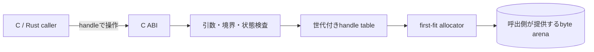
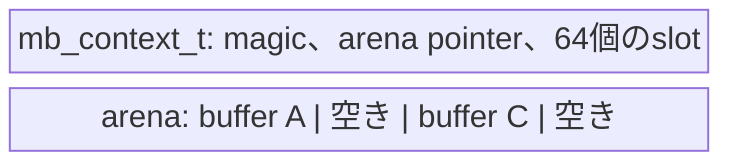
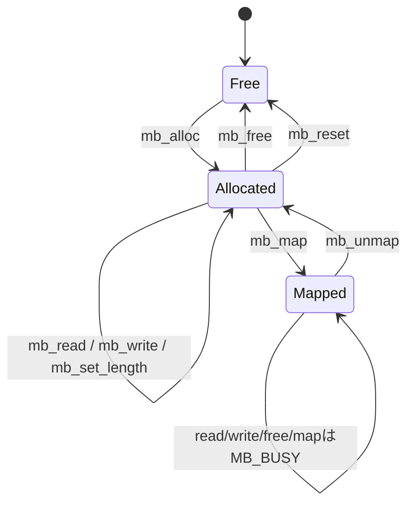

# 構成と責務

## ライブラリ境界

`memory-buffer`は、呼出側が提供したbyte arenaを複数のバッファとして安全に扱う
ためのライブラリである。内部pointer、空き領域、世代番号、map状態を隠蔽し、
利用者にはC ABIとopaque handleだけを公開する。

ライブラリはarena内の領域とその所有状態だけを管理する。格納するbyte列の意味、
生成元、利用先、I/O方式は認識しない。そのため、通信、画像、音声、file処理、
一時work bufferなど用途を限定せず利用できる。

## 隠蔽するもの

呼出側から次の詳細を隠蔽する。

- arena内のoffsetと空き領域探索
- bufferごとのcapacityと論理長
- slotの再利用と世代番号
- 解放済みhandleの判定
- map中かどうかの状態
- read/write可能範囲の検査

呼出側はhandleのbit layoutや実アドレスを解釈しない。通常操作は
`mb_read`と`mb_write`を使い、直接accessが必要な期間だけ`mb_map`でpointerを
借りる。

## 内部構成

1つの`mb_context_t`は最大64個の生存中バッファmetadataを保持する。payload本体は
context内には格納せず、`mb_init`へ渡されたarenaに置く。

各slotが保持する情報:

- arena内offset
- 論理長
- 割当capacity
- 世代番号
- map状態

C handleにはslot indexと世代番号を符号化する。slot解放時に世代を進めるため、
古いhandleから、同じslotへ後で作られた別バッファにはアクセスできない。

## バッファ状態

mapは排他的なpointer貸出である。二重`mb_map`を拒否し、map中は`mb_read`、
`mb_write`、`mb_set_length`、`mb_free`、`mb_reset`が`MB_BUSY`を返す。
これにより、貸出pointerと通常APIが同じ領域を同時に変更することを防ぐ。

## 呼出側に残る責務

- contextとarenaのstorageを必要な期間保持する
- 1つのcontextへのAPI callを直列化する
- mapしたpointerを`mb_unmap`後に使用しない
- `mb_unmap`前にpointer利用がすべて終了したことを保証する
- arenaに必要なalignmentやmemory属性を利用環境に合わせて選ぶ

## 制約

- context内部では排他制御しない
- allocationはfirst-fitであり、生存中データのcompactionは行わない
- 1 contextにつき同時に最大64 buffer
- arenaの内容はfreeやreset時に消去しない
- 再初期化前に、以前のhandleとmap pointerの利用をすべて終了する
