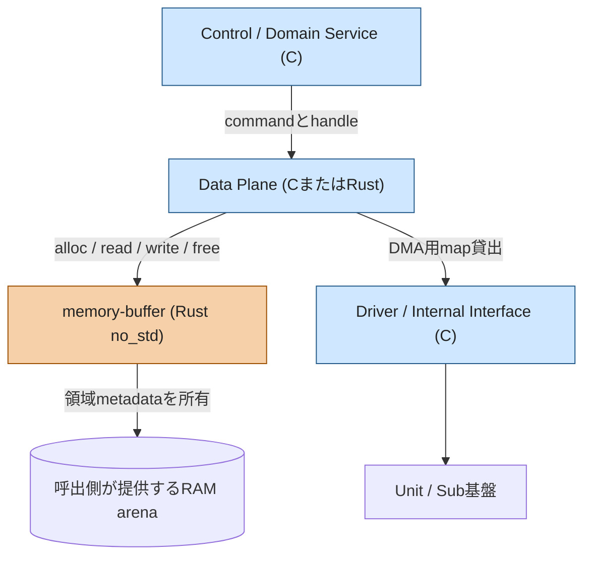
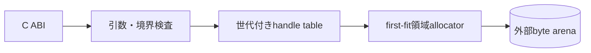
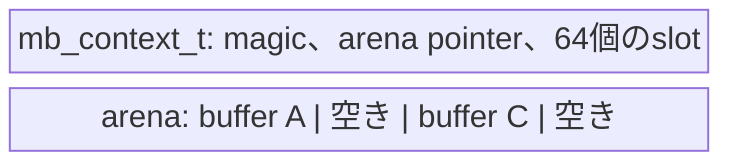
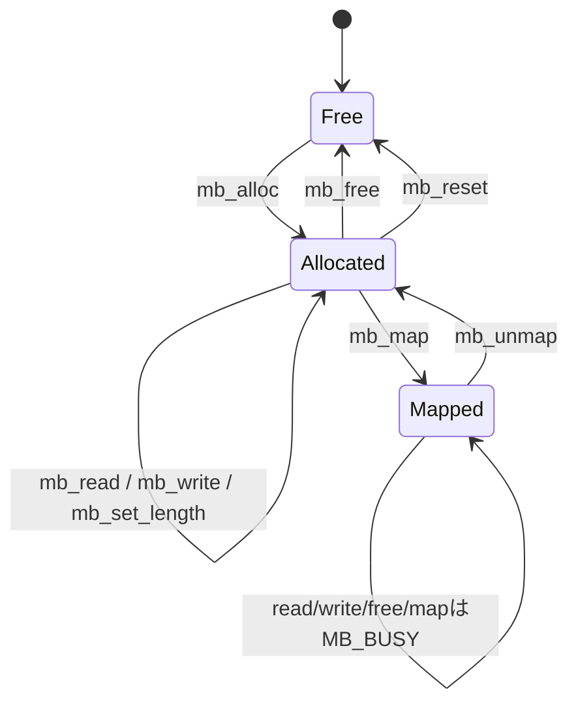

# 構成と責務

## コンポーネント境界

`memory-buffer`は末端の共通コンポーネントである。byte列と所有権だけを扱い、
そのデータが印刷用なのか、通信受信用なのかは認識しない。

Data Planeはpayloadの業務上の生存期間を所有する。`memory-buffer`はRAM領域の
生存期間だけを所有する。Driverにはバッファ所有権ではなく一時ポインタを貸し出す。

## 内部構成

1つの`mb_context_t`は最大64個の生存中バッファmetadataを保持する。payload本体は
context内には格納せず、`mb_init`へ渡されたarenaに置く。

各slotが保持する情報は次のとおり。

- arena内offset
- 論理長
- 割当capacity
- 世代番号
- map貸出数

C handleにはslot indexと世代番号を符号化する。slot解放時に世代を進めるため、
古いhandleから同じslotに後で作られた別バッファへアクセスできない。

## バッファ状態遷移

mapは排他的貸出であり、二重`mb_map`を拒否する。map中は`mb_read`、`mb_write`、
`mb_set_length`、`mb_free`、`mb_reset`が`MB_BUSY`を返す。これによりDMAとCPU、
または複数taskによる同一領域への競合accessをlibrary境界で防ぐ。

## 制約

- context内部では排他制御しない
- 生存中データのcompactionは行わない
- DMA cache maintenanceとarena base以上のalignment調整はplatform側で行う
- mapしたポインタを対応する`mb_unmap`後まで保持してはならない
- 再初期化前に、以前の利用者をすべて停止しなければならない
