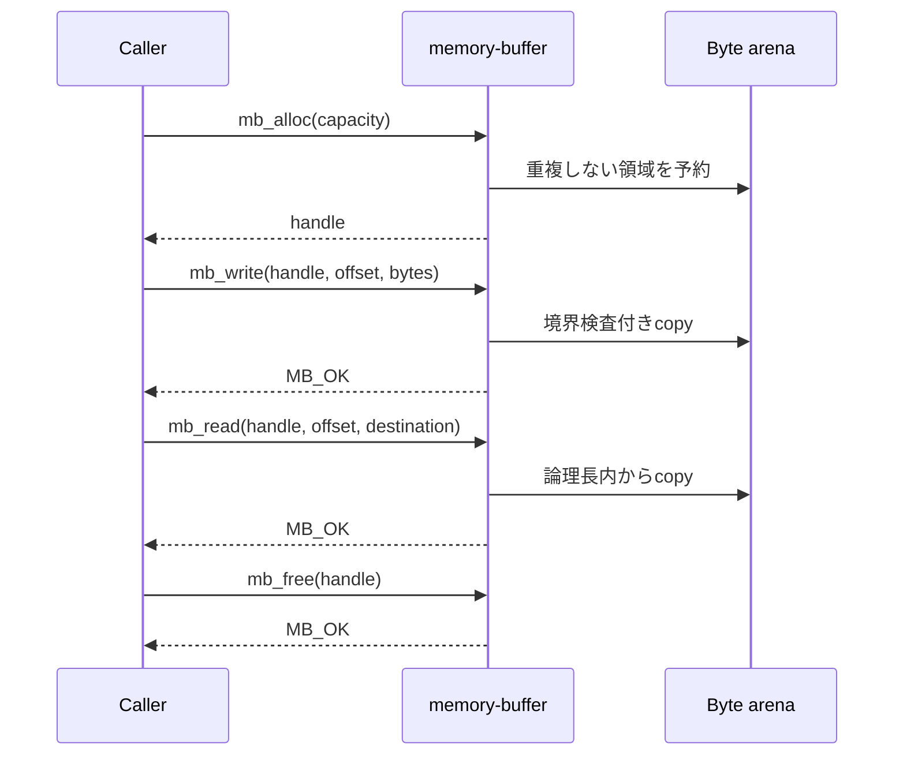
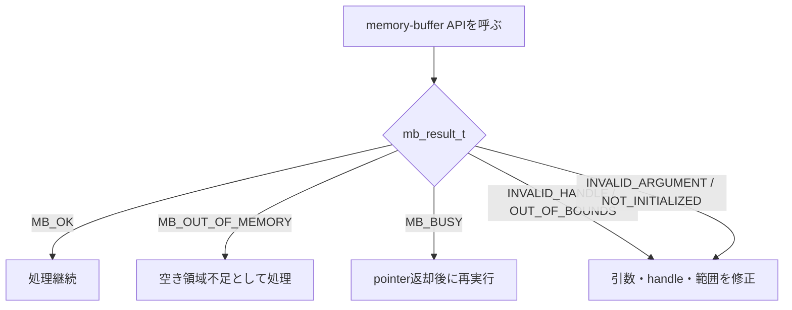

# 使い方

## C applicationへ追加する

`memory-buffer`は呼出側が所有するcontext storageとbyte arenaを使用する。
library内部でheap allocationは行わない。

```c
#include "memory_buffer.h"

static mb_context_t buffer_context;
static uint8_t buffer_arena[64u * 1024u];

void buffers_init(void)
{
    mb_result_t result = mb_init(
        &buffer_context,
        sizeof(buffer_context),
        buffer_arena,
        sizeof(buffer_arena));

    assert(result == MB_OK);
}
```

`memory-buffer/include/memory_buffer.h`をinclude pathへ追加し、
`cargo build -p memory-buffer --release --no-default-features`で生成される
`libmemory_buffer.a`をC applicationへlinkする。付属の`CMakeLists.txt`は、
この手順をhost上でbuild・実行する例である。

## 基本操作

通常は`mb_alloc`、`mb_write`、`mb_read`、`mb_free`を使用する。利用者がarena内の
offsetやpointerを保持する必要はなく、bufferはhandleで識別する。



```c
mb_handle_t handle;
uint8_t output[4];
const uint8_t input[4] = {0x10, 0x20, 0x30, 0x40};

if (mb_alloc(&buffer_context, 1024u, &handle) != MB_OK) {
    /* 空き領域不足として処理する。 */
    return;
}

if (mb_write(&buffer_context, handle, 0u, input, sizeof(input)) != MB_OK) {
    mb_free(&buffer_context, handle);
    return;
}

if (mb_read(&buffer_context, handle, 0u, output, sizeof(output)) != MB_OK) {
    mb_free(&buffer_context, handle);
    return;
}

mb_free(&buffer_context, handle);
```

`mb_write`は書き込んだ末尾まで論理長を伸ばす。`mb_read`はcapacityではなく
論理長を越える読み出しを拒否する。

## 内容へ直接accessする

copyを避ける必要がある場合は`mb_map`でbuffer全capacityへのpointerを一時的に
借りる。map中は同じbufferへのread、write、再map、length変更、freeを行えない。

```c
uint8_t *data;
size_t capacity;

if (mb_map(&buffer_context, handle, &data, &capacity) == MB_OK) {
    size_t written = fill_buffer(data, capacity);

    /* dataを参照する処理がすべて終わってから返却する。 */
    mb_unmap(&buffer_context, handle);

    /* 初期化済みの範囲だけを論理長として公開する。 */
    mb_set_length(&buffer_context, handle, written);
}
```

map pointerは所有権の移譲ではない。`mb_unmap`後に保存・参照してはならない。

## Event Utilityへ接続する

```c
#include "memory_buffer_event_adapter.h"

ut_event_buffer_pool_t event_pool =
    mb_event_buffer_pool(&context);
```

`event_pool`を`ut_event_buffer_message_create_copy`へ渡すと、Memory Buffer handleを
所有するEvent Envelopeを作成できる。EnvelopeをQueueから取り出したconsumerは、
処理後に`ut_event_buffer_message_release`でhandleを返却する。
非同期処理へpointerを渡した場合も、その処理が完全に終了してからunmapする。

## Buffer情報を取得する

`mb_get_info`で論理長、capacity、map状態を取得できる。

```c
mb_buffer_info_t info;

if (mb_get_info(&buffer_context, handle, &info) == MB_OK) {
    printf("length=%zu capacity=%zu mapped=%u\n",
           info.length, info.capacity, info.mapped);
}
```

## 全bufferを破棄する

`mb_reset`はcontext内の全bufferを解放し、既存handleを無効化する。arenaのbyteは
消去しない。map中のbufferが1つでもある場合は`MB_BUSY`を返す。

```c
mb_result_t result = mb_reset(&buffer_context);
```

## Error処理



`MB_OUT_OF_MEMORY`は利用可能なarenaまたはslotの不足である。`MB_BUSY`はmap中の
操作競合を表す。`MB_INVALID_HANDLE`、`MB_OUT_OF_BOUNDS`、
`MB_INVALID_ARGUMENT`は通常、呼出側の契約違反として扱う。

## Thread safety

library内部にlockはない。同じcontextを複数threadから利用する場合は、すべての
API callを同じ外部lockで直列化する。異なるcontext同士は独立している。

## 検証

localのRust/C結合テスト:

```sh
make test
```

format、静的解析、coverage、ABI header、`no_std` cross buildを含む品質ゲート:

```sh
make check
```
