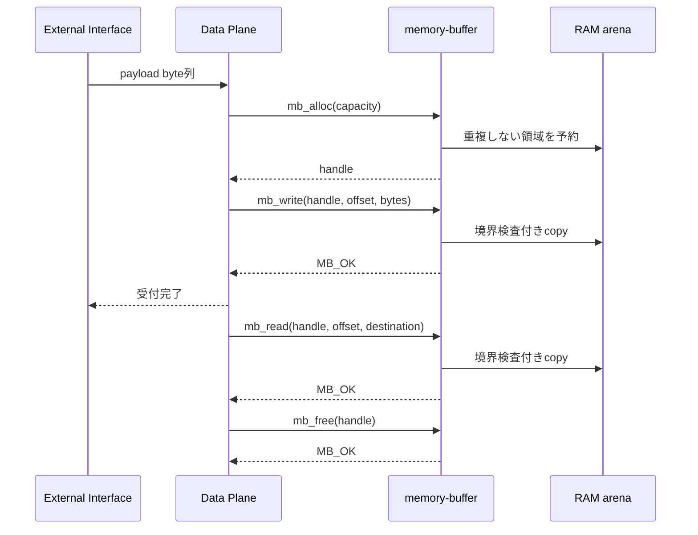
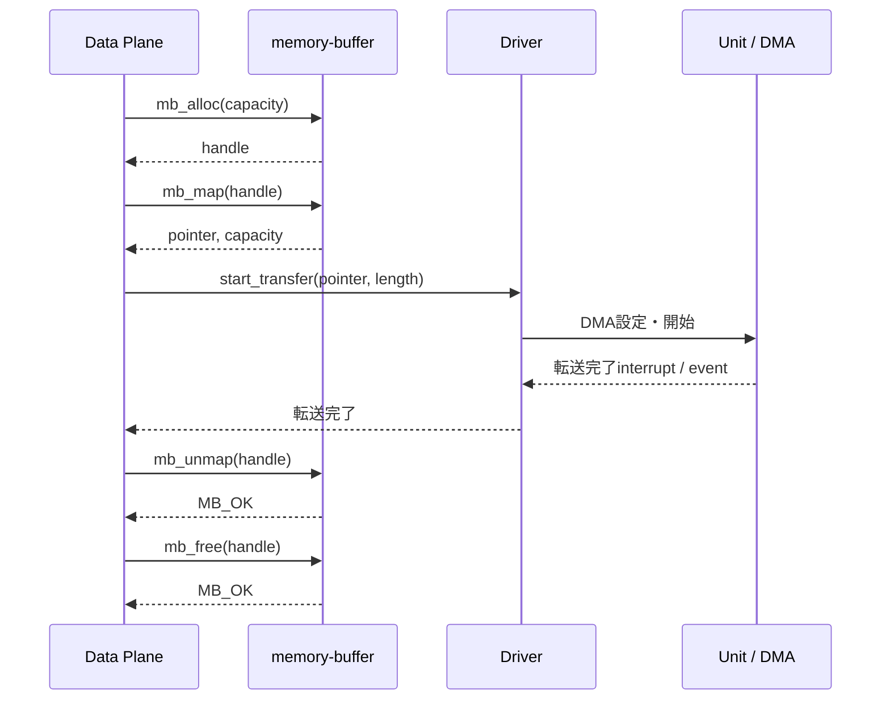
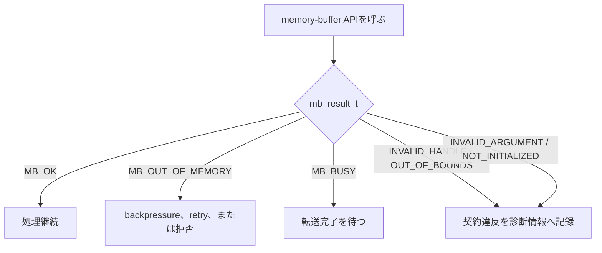

# 使い方

## C firmwareへの組み込み

C applicationが制御領域とpayload arenaを静的に所有する。

```c
#include "memory_buffer.h"

static mb_context_t buffer_context;
static uint8_t payload_arena[64u * 1024u];

void data_plane_init(void)
{
    mb_result_t result = mb_init(
        &buffer_context,
        sizeof(buffer_context),
        payload_arena,
        sizeof(payload_arena));

    /* 失敗時はfirmware起動時のfault方針へ渡す。 */
    assert(result == MB_OK);
}
```

Cargoが生成する`libmemory_buffer.a`を既存C firmwareへlinkする。付属の
`CMakeLists.txt`は、その組み込みをhost上で実行・検証する例である。

## Copyを使う通常経路

protocol処理や通常のData Plane処理では`mb_write`と`mb_read`を使う。
raw pointerの生存期間を1回のAPI call内へ閉じ込められる。



```c
mb_handle_t handle;
uint8_t output[4];
const uint8_t input[4] = {0x10, 0x20, 0x30, 0x40};

if (mb_alloc(&buffer_context, 1024u, &handle) != MB_OK) {
    /* Data Planeでbackpressureをかけるか、requestを拒否する。 */
}

if (mb_write(&buffer_context, handle, 0u, input, sizeof(input)) != MB_OK) {
    mb_free(&buffer_context, handle);
}

mb_read(&buffer_context, handle, 0u, output, sizeof(output));
mb_free(&buffer_context, handle);
```

## DMAまたはZero-copy経路

Driverが直接memory accessを必要とする場合だけ`mb_map`を使う。



deviceからmemoryへDMA受信した場合は、転送完了後に論理長を設定する。

```c
uint8_t *data;
size_t capacity;

if (mb_map(&buffer_context, handle, &data, &capacity) == MB_OK) {
    driver_receive_async(data, capacity, handle);
}

/* 後でDriver完了eventを受けたData Planeから実行する。 */
driver_stop_using_buffer();
mb_unmap(&buffer_context, handle);
/* DMAが実際に書き込んだ初期化済み範囲だけを公開する。 */
mb_set_length(&buffer_context, handle, received_length);
```

Driverの完了経路では、最後の`mb_unmap`より前にDMA、interrupt、遅延callbackが
`data`を参照しない状態になったことを保証する。
map中は同じバッファへのread、write、再map、length変更、freeを行えない。

## Error処理



資源不足とprogramming errorには異なる復旧方針を適用する。特に
`MB_INVALID_HANDLE`や`MB_OUT_OF_BOUNDS`が繰り返される場合はfirmware不具合であり、
診断情報から観測可能にする。

## 検証

localの品質ゲートは次のコマンドでまとめて実行する。

```sh
make check
```

format、Clippy、Rust単体テスト、Rustdoc生成、`no_std` static library、
C結合実行ファイルを検証する。
