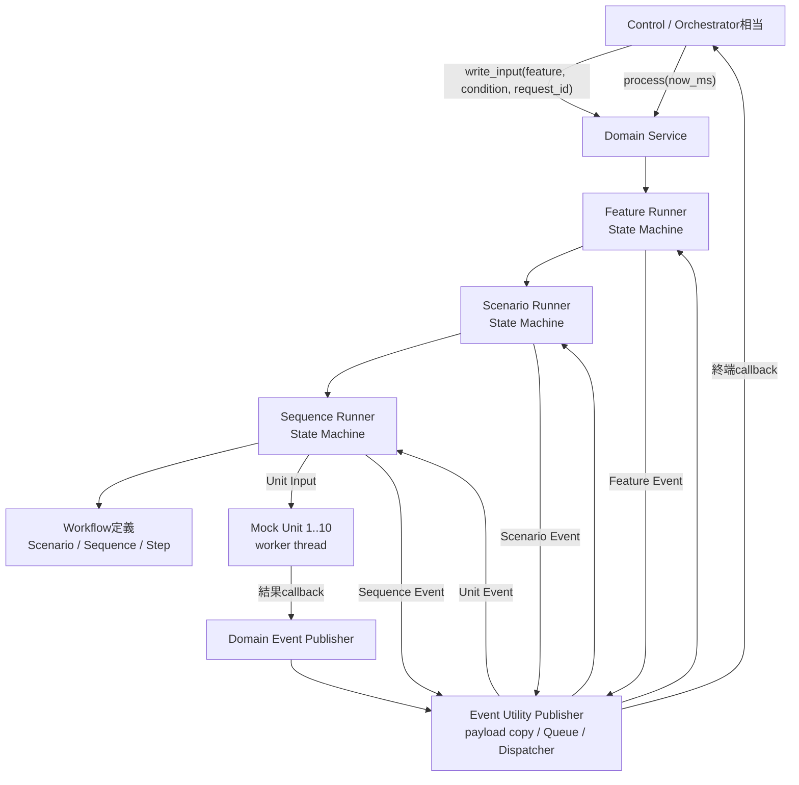
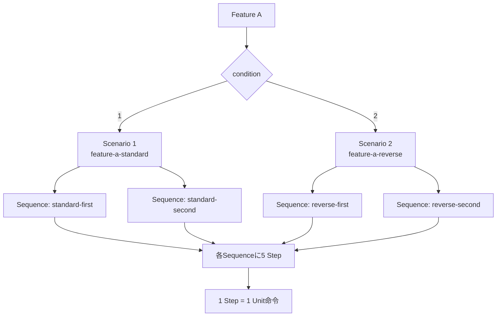
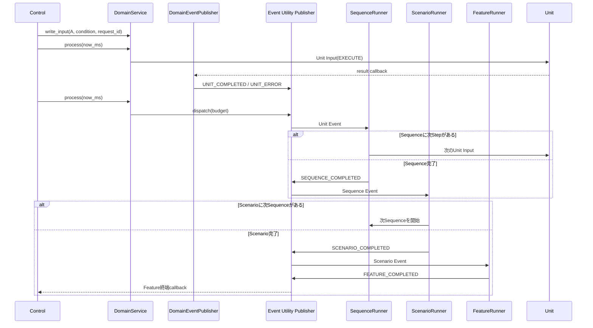
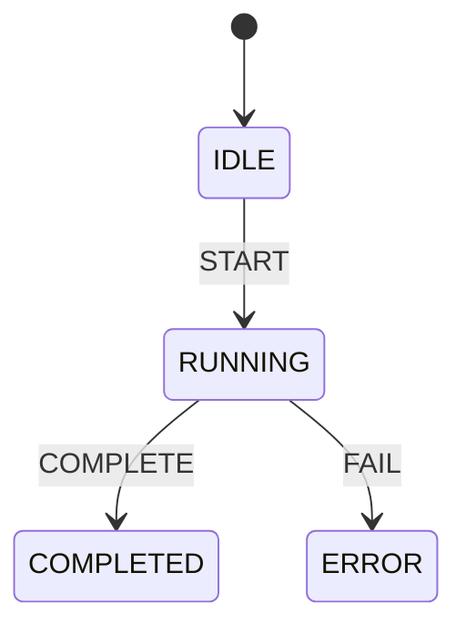
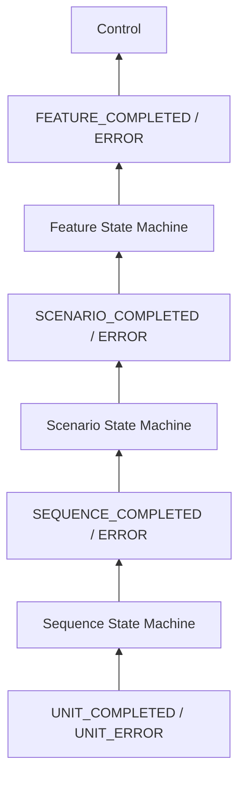
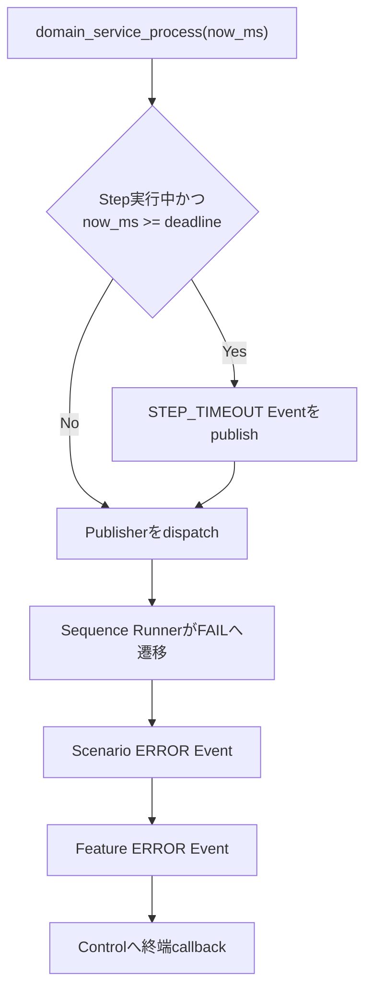
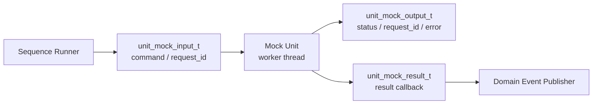

# src サンプルアーキテクチャ

`src`配下は、Controlから機能単位の要求を受け、DomainがScenario、Sequence、Stepを
進行し、非同期Unitを動かすサンプル実装である。

現在はA機能のWorkflowだけを実装している。B機能からE機能は公開enumへ予約しているが、
Scenarioや実行処理は未実装である。

## ディレクトリ構造

```text
src/
├── README.md
├── domain/
│   ├── domain_service.h/.c
│   ├── domain_event_publisher.h/.c
│   ├── domain_workflow.h/.c
│   └── domain_service_sample.c
└── unit/
    ├── unit_mock.h/.c
    └── unit_mock_sample.c
```

| ファイル | 責務 |
| --- | --- |
| `domain_service` | Feature、Scenario、Sequence Runnerと状態遷移を管理する |
| `domain_event_publisher` | Domain Event ID、payload、Unit結果変換を定義する |
| `domain_workflow` | Scenario、Sequence、Stepの不変な構成データを定義する |
| `domain_service_sample` | Control相当の初期化、周期実行、終端Event受信例 |
| `unit_mock` | Inputを受けてworker threadで非同期実行するMock Unit |
| `unit_mock_sample` | 10個のUnitを直接起動する単体利用例 |

## 全体構造



Domain Event PublisherはDomain固有のEvent IDとpayload変換を担当する。Queue、
payload値copy、排他、Dispatcher、budget配送は
`Utility/event`の`ut_event_publisher_t`を使用する。

## Workflow階層



条件1はUnit 1から10を順番に実行する。条件2はUnit 10から1を順番に実行する。
どちらも2 Sequence、合計10 Stepである。

`domain_workflow`は構成データだけを持ち、現在位置や実行状態を持たない。状態はRunnerが
所有するため、同じWorkflow定義を要求ごとに再利用できる。

## Eventの流れ



Unitのworker threadはDomain Runnerを直接呼ばない。Unit結果callbackはEventをQueueへ
積むだけであり、Runnerの状態遷移はControl threadから`domain_service_process()`を
呼んだときに同期実行される。

## State Machine

Feature、Scenario、Sequenceはそれぞれ独立したState Machineを持つ。



これはEvent Utilityのflat State Machineを3階層に配置し、PublisherのEventで接続した
構成である。親子状態を1つのState Machine tableで表す専用HSMではないが、子Runnerの
終端Eventを親Runnerが受信するため、実行モデルとして階層的に振る舞う。



各Runnerは自分の完了条件だけを判断する。

- Sequence Runner: 全Stepが完了したか
- Scenario Runner: 全Sequenceが完了したか
- Feature Runner: Scenarioが終端状態になったか
- Publisher: Eventの値copy、Queue格納、配送だけを行う

Publisherは完了条件や次の実行内容を判断しない。

## Timeout

各Stepは`timeout_ms`を持つ。Controlは単調増加時刻を
`domain_service_process(service, now_ms)`へ渡す。



Unitの完了確認はOutput pollingではない。Unitから届く非同期結果Eventが通常の進行契機で
あり、`process()`の時刻確認はtimeout Eventを生成するために使用する。

## Controlとの境界

Controlが扱うのは機能単位のInputとOutputである。

```c
domain_service_input_t input = {
    .feature = DOMAIN_FEATURE_A,
    .condition = 1U,
    .request_id = 1000U,
};

domain_service_set_event_handler(service, on_feature_event, control_context);
domain_service_write_input(service, &input);

for (;;) {
    domain_service_process(service, monotonic_now_ms());
}
```

Controlは次の判断を担当する。

- どの機能をいつ開始するか
- 機能間の排他、優先順位、スケジュール
- Feature完了後に次の機能を開始するか
- Featureエラー後にセルフチェックや全体停止を行うか

ControlはStepやSequenceの次位置を決定しない。

`domain_service_read_output()`は現在状態と進捗のsnapshot取得用である。正常な実行進行は
Output pollingではなく、PublisherからのFeature終端callbackを契機とする。

## Unitの境界

Unitは単なる同期関数ではなく、Input、Output snapshot、非同期結果通知を持つ部品である。



現在のMock Unitは処理関数名をLog Utilityへ出力し、約500ミリ秒待って完了する。
Unit 1から10はそれぞれ独立したworker threadを持つ。

## 実行方法

Domain Workflow全体:

```bash
make domain-service-sample
```

10個のMock Unitだけを直接動かす例:

```bash
make unit-mock-sample
```

Repository全体の品質ゲート:

```bash
make check
```

## 重要な設計上の注意

### Event駆動の範囲

Unit完了からFeature終端まではEventで駆動する。Controlが
`domain_service_process()`を周期的に呼ぶ必要はあるが、これはEvent Queueの配送と
timeout判定を進めるEvent Loopであり、Unit Outputを調べるpolling処理ではない。

### thread境界

Unit callbackはUnit worker thread上で動く。Event Utility Publisherはpayloadを固定長
slotへ値copyし、lock callbackでQueueを保護する。Runner handlerはControl thread上の
dispatch中に同期実行されるため、State MachineをUnit workerから並行操作しない。

### payloadの寿命

Domain Event payloadはPublisher内部へ値copyされる。handlerへ渡されたpayload pointerは
handler実行中だけ有効であり、後から参照する場合は値を複製する。

### 所有権

Domain ServiceはUnit配列と各Unitを所有しない。UnitはDomain Serviceより長く生存させ、
Domain Service破棄後にUnitを破棄する。

### 現在の制限

- 実装済み機能はAのみ
- Workflowは逐次実行のみ
- Stepの並列実行、分岐、join、rollbackは未実装
- cancel、一時停止、再開は未実装
- 専用HSMの親状態、history state、並行状態は未実装
- Domain Service自身の並行呼び出しは想定していない
