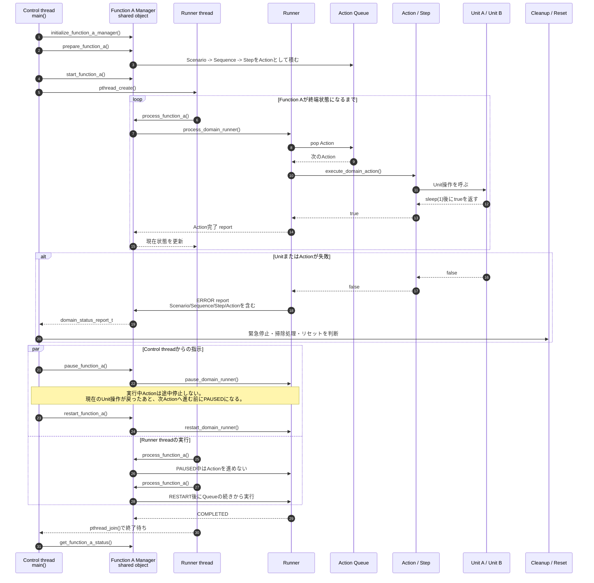

# control

アプリケーション全体の起点となる制御層です。

`control` は、どのシナリオをいつ開始するかを判断し、`domain` へ実行要求を渡す役割を持ちます。
`Scenario`、`Sequence`、`Step` の詳細な進行管理や、各 `Unit` の具体的な操作内容はここでは扱いません。

## この層の考え方

`control` は、製品やアプリケーション全体から見た「外側の判断」を担当します。
たとえば、ユーザー操作、上位システムからの要求、タイマー、異常検知などをきっかけにして、
どの業務処理を開始するかを決めます。

一方で、開始した後の細かい手順は `domain` に任せます。
`control` が `Step` の順番や `Unit` の関数呼び出しを直接知ってしまうと、
ワークフローの変更があるたびにアプリケーション全体へ影響が広がります。
そのため、このサンプルでは `control` は「何を開始するか」までを責務とします。

## 読み方

まずは、次の分担を意識してください。

- `control` は、シナリオを開始する入口
- `domain` は、シナリオの中身を進める場所
- `unit` は、実際の部品や機能を操作する場所

たとえば「通常運転を開始する」という要求が来た場合、
`control` は「通常運転シナリオを開始して」と `domain` に依頼します。
その後に、どの `Sequence` を実行するか、どの `Step` でどの `Unit` を動かすかは、
`domain` 側で判断します。

## 今回追加した実装

`src/main.c` に、Function Aを実行する最小のアプリケーション入口を置いています。
このサンプルでは、Control threadとRunner threadを分けています。
`src/error_demo_main.c` には、Function BのエラーScenarioを使って、
ERROR通知、清掃処理、リセット処理の流れを確認する入口を置いています。

```text
control/
├── include/
├── src/
│   ├── main.c
│   └── error_demo_main.c
└── test/
```

`main.c` では、次の順番でFunction Aを実行します。

```text
initialize_function_a_manager()
prepare_function_a()
start_function_a()
Runner threadを起動する
Runner threadがprocess_function_a()を完了まで繰り返す
Control threadからpause/restartを指示する
```

`prepare_function_a()` では、Function AのScenario、Sequence、StepがAction Queueへ展開されます。
この時点ではUnitはまだ動きません。

`start_function_a()` でRunnerが実行可能状態になります。
その後、Runner threadが `process_function_a()` を呼ぶたびに、
Action QueueからActionが1つ取り出されて実行されます。

Control threadは、Runner threadとは別に動きます。
このため、Control thread側から `pause_function_a()` や `restart_function_a()` を呼べます。

ただし、このサンプルのUnit処理は同期関数です。
Unit操作中に `sleep(1)` している間、そのAction自体は途中停止しません。
pauseは、現在実行中のActionが戻ったあと、次のActionへ進む前に反映されます。

domain層からControlへは、`domain_status_report_t` で状態が通知されます。
このレポートには、イベント種別だけでなく、Function名、Scenario名、Sequence名、Step名、
Action名、進捗番号、エラーコード、メッセージが含まれます。

Unit操作やAction実行に失敗した場合は、RunnerがERRORへ遷移し、ControlへERRORレポートを通知します。
Controlはその情報を使って、緊急停止、掃除処理、リセット処理、復旧シナリオ起動などを判断します。

## スレッドと実行シーケンス

このサンプルでは、Control threadとRunner threadの2本で動きます。



ポイントは、Runner threadだけがAction Queueを進めることです。
Control threadは、Function A ManagerのAPIを通じて開始、一時停止、再開を指示します。

`function_a_manager_t` は2つのthreadから触られるため、`main.c` では `pthread_mutex_t` で保護しています。
このサンプルではUnit操作中もmutexを保持するため、pause/restartの反映はAction境界になります。

## 実行方法

リポジトリのルートで次を実行します。

```bash
make run-control
```

ビルドだけ行う場合は次を実行します。

```bash
make control
```

生成される実行ファイルは次です。

```text
build/control_app
```

直接実行する場合は次のようにします。

```bash
build/control_app
```

エラー発生時のControl処理を確認する場合は次を実行します。

```bash
make run-control-error
```

生成される実行ファイルは次です。

```text
build/control_error_app
```

## 確認ポイント

`control` の `main.c` は、Unit AやUnit Bの関数を直接呼びません。
また、Scenario、Sequence、Stepの配列も直接見ません。

Controlが知っているのは、Function A ManagerのAPIだけです。

```c
initialize_function_a_manager(...);
prepare_function_a(...);
start_function_a(...);
process_function_a(...);
get_function_a_status(...);
```

この分け方により、Controlは「機能をいつ動かすか」に集中できます。
機能の中身やUnitの操作順序は、`domain` 層の責務です。
