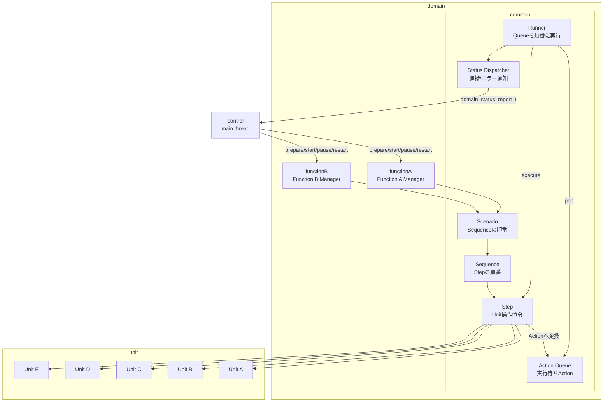
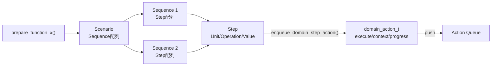

# domain

シナリオ、シーケンス、ステップの構造と実行状態を管理する層です。

この層では、`Scenario > Sequence > Step` という階層でワークフローを表現します。
`Step` は最小の指示命令単位であり、実際の部品操作は `unit` 層へ依頼します。

## 階層の意味

このサンプルで扱うワークフローは、次の3段階で考えます。

```text
Scenario
  └── Sequence
        └── Step
```

`Scenario` は、ひとまとまりの業務や機能を表します。
たとえば「通常運転」「停止処理」「診断処理」のような単位です。

`Sequence` は、`Scenario` の中にある手順のまとまりです。
たとえば「初期化する」「測定する」「結果を保存する」のように、
ある程度意味のある処理の列を表します。

`Step` は、最小の指示命令単位です。
`Step` は「Unit Aを開く」「Unit Bを移動する」「Unit Cの状態を確認する」のように、
最終的に `unit` 層へ渡す操作命令に対応します。

## 責務の分け方

`domain` は、作業の順番と状態を管理します。
ただし、部品そのものの具体的な操作は持ちません。

たとえば `domain` は「次はUnit AをopenするStepだ」と判断します。
しかし、Unit Aをopenしたときにどのレジスタへ書き込むか、どの通信を使うか、
どのドライバを呼ぶかは `unit` 側の責務です。

この分け方にすると、ワークフローの変更と部品操作の変更を分離できます。
手順を変えたい場合は `domain` を見る。
部品の動作を変えたい場合は `unit` を見る。
コードを追うときにも、見る場所を切り分けやすくなります。

## このサンプルで表現する構造

このサンプルでは、C言語の構造体や関数で次の関係を表現します。

```text
Stepの配列がSequenceになる
Sequenceの配列がScenarioになる
ScenarioをAction Queueへ展開する
RunnerがAction Queueを順番に実行する
Actionの実行時にUnitの関数が呼ばれる
```

## 全体ブロック図

`domain` は、Controlから機能単位の要求を受け取り、Unitへ渡す実行命令の流れを作ります。
Controlは細かいStepを知らず、UnitもScenarioやSequenceを知りません。



## Action Queue展開フロー

`prepare_function_a()` や `prepare_function_b()` では、まだUnitは動きません。
この段階では、ScenarioをたどってAction QueueへActionを積むだけです。



Actionには、実行関数だけでなく進捗通知に使う情報も入ります。

```text
scenario_name
sequence_name
step_name
step_index
total_step_count
```

## ファイル構成

```text
domain/
├── common/
│   ├── include/
│   │   ├── domain_action.h
│   │   ├── domain_action_queue.h
│   │   ├── domain_step.h
│   │   ├── domain_sequence.h
│   │   ├── domain_scenario.h
│   │   ├── domain_runner.h
│   │   └── domain_status_dispatcher.h
│   ├── src/
│   │   ├── domain_action.c
│   │   ├── domain_action_queue.c
│   │   ├── domain_step.c
│   │   ├── domain_sequence.c
│   │   ├── domain_scenario.c
│   │   ├── domain_runner.c
│   │   └── domain_status_dispatcher.c
│   └── test/
├── functionA/
│   ├── include/
│   │   └── function_a_manager.h
│   ├── src/
│   │   └── function_a_manager.c
│   └── test/
│       └── test_function_a_manager.c
└── functionB/
    ├── include/
    │   └── function_b_manager.h
    ├── src/
    │   └── function_b_manager.c
    └── test/
        └── test_function_b_manager.c
```

`domain_step`、`domain_sequence`、`domain_scenario` は、あえてファイルを分けています。
この3つはワークフローの階層を表す中心概念なので、同じファイルへまとめるよりも、
それぞれの責務が見える形にしています。

`common/` には、複数機能で使い回す共通部品を置きます。
たとえばAction、Action Queue、Runner、Scenario、Sequence、Step、Status Dispatcherです。

一方で、Function Aのような機能固有のManagerやテストは `functionA/` 配下へ置きます。
機能が増えた場合は、`functionB/`、`functionC/` のように同じ形で追加します。

```text
domain/
├── common/
├── functionA/
├── functionB/
└── functionC/
```

この分け方にすると、新しい機能を追加するときに共通Runnerを触るのか、
機能固有Managerだけを触るのかを判断しやすくなります。

まず `functionA/` または `functionB/` から読むのがおすすめです。
機能固有のScenarioがどのようにAction Queueへ積まれるかを見てから、
必要に応じて `common/` のRunnerやQueueを読むと理解しやすくなります。

## Action QueueとRunner

Runnerは、Unit AやUnit Bを直接知りません。
Runnerが知っているのは、Queueに積まれた `domain_action_t` だけです。

```c
typedef struct {
    const char *name;
    domain_action_execute_fn execute;
    void *context;
} domain_action_t;
```

Runnerは次のように考えます。

```text
QueueからActionを取り出す
Actionのexecuteを呼ぶ
成功したら次のActionへ進む
失敗したらERRORにする
```

つまり、Runnerは「これはUnit Aのopenである」といった具体的な意味を知りません。
具体的なUnit操作を知っているのは `domain_step.c` です。

## Function A Manager

`functionA/function_a_manager` は、機能単位の管理役です。
今回のサンプルでは、Function Aだけを用意しています。

`prepare_function_a()` が呼ばれると、Function A用のScenarioを選びます。
そのScenarioに含まれるSequenceとStepをたどり、最終的にAction QueueへActionを積みます。

`start_function_a()` が呼ばれると、RunnerがAction Queueを順番に実行します。
`pause_function_a()` で一時停止し、`restart_function_a()` で再開します。
`terminate_function_a()` で終了状態にできます。

## Function B Manager

`functionB/function_b_manager` は、Function Aと同じ構造を使った別機能の例です。

Function AはUnit A/Bを使うScenarioにしています。
Function BはUnit C/Dを使うScenarioにしています。

この2つを見比べると、共通のRunnerやAction Queueを変えずに、
機能ごとのScenario、Sequence、Stepだけを差し替える流れが分かります。

## 状態通知

RunnerやFunction Managerの状態変化は、`domain_status_dispatcher` から外側へ通知します。
このサンプルでは `functionA/test/test_function_a_manager.c` の中にControl相当のコールバックを置き、
domainから通知されたイベントを表示しています。
