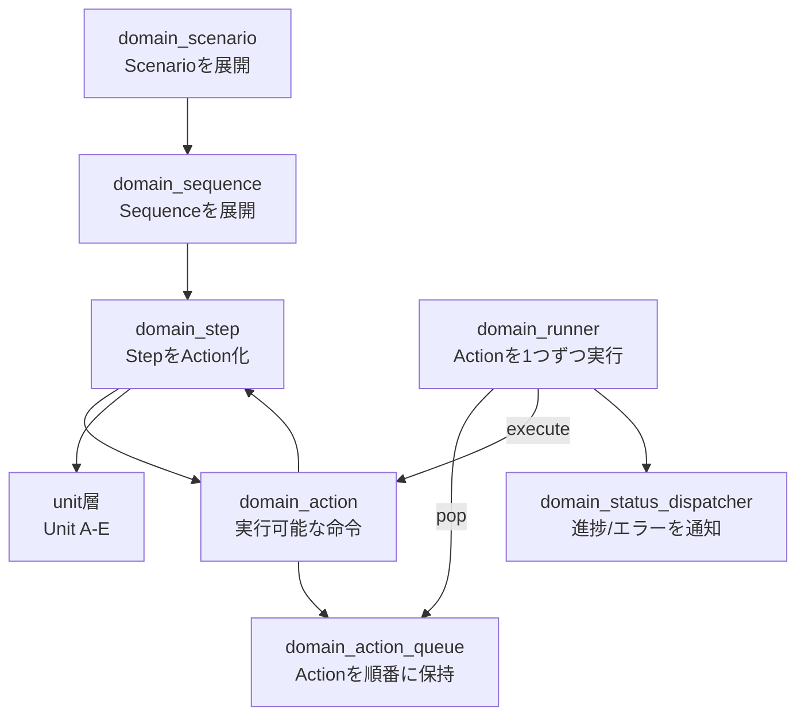
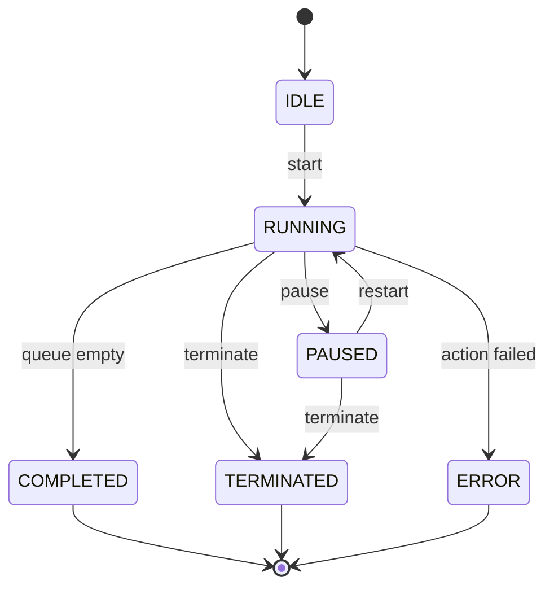
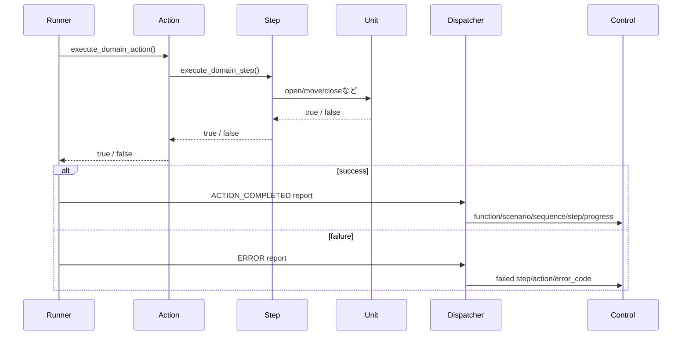

# common

複数のdomain機能から使い回す共通部品を置くフォルダです。

## 役割

`common` は、Function AやFunction Bのような個別機能に依存しない部品をまとめます。

ここに置くものは、特定の機能名を知らなくても使えるものです。
たとえば、Action、Action Queue、Step、Sequence、Scenario、Runner、Status Dispatcherが該当します。

## 構成

```text
common/
├── include/
│   ├── domain_action.h
│   ├── domain_action_queue.h
│   ├── domain_step.h
│   ├── domain_sequence.h
│   ├── domain_scenario.h
│   ├── domain_runner.h
│   └── domain_status_dispatcher.h
├── src/
│   ├── domain_action.c
│   ├── domain_action_queue.c
│   ├── domain_step.c
│   ├── domain_sequence.c
│   ├── domain_scenario.c
│   ├── domain_runner.c
│   └── domain_status_dispatcher.c
└── test/
```

## 読み方

最初から `common` を全部読む必要はありません。

まず `functionA/src/function_a_manager.c` や `functionB/src/function_b_manager.c` を読み、
機能固有のScenario、Sequence、Stepがどのように並ぶかを見てください。

そのあとに、次の順番で `common` を読むと分かりやすいです。

1. `domain_step`
2. `domain_sequence`
3. `domain_scenario`
4. `domain_action_queue`
5. `domain_runner`

`domain_step` はStepをUnit操作へ変換する場所です。
`domain_runner` はAction QueueからActionを取り出して実行する場所です。

## 共通部品の関係



## Runnerの状態遷移

RunnerはAction Queueを実行するだけの部品です。
start、pause、restart、terminateによって状態が変わります。



## 進捗通知の流れ

Actionが完了するたびに、Runnerは `domain_status_report_t` を作ってDispatcherへ渡します。
Control側はこのレポートで進捗表示や異常時の処理を判断します。


