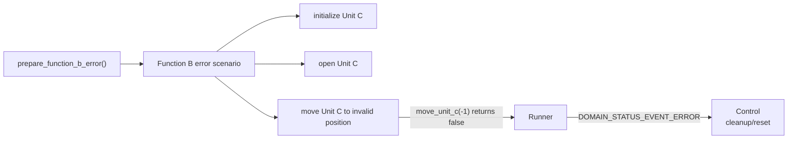

# functionB

Function B固有のScenario選択、Action Queue構築、Runner操作を管理するフォルダです。

## 役割

Function Bは、Function Aと同じ共通domain部品を使う別機能のサンプルです。
共通部品とは、Action、Action Queue、Scenario、Sequence、Step、Runner、Status Dispatcherのことです。

このフォルダには、Function Bだけが知っていればよいScenario定義とManager処理を置きます。

## 構成

```text
functionB/
├── include/
│   └── function_b_manager.h
├── src/
│   └── function_b_manager.c
└── test/
    └── test_function_b_manager.c
```

## Function Aとの違い

Function AはUnit A/Bを使うScenarioでした。
Function BはUnit C/Dを使うScenarioにしています。

Managerの形は同じです。
違うのは、どのStepをどの順番で並べるかです。
この差分を見ると、「機能固有の流れ」と「共通の実行仕組み」を分ける意味が分かります。

## 読み方

まず `src/function_b_manager.c` のStep配列を見てください。
Function BではUnit Cを準備し、Unit Dを実行側で動かします。

次にSequence配列、Scenario定義、`prepare_function_b()` の順に読むと、
StepがAction Queueへ積まれる流れを追えます。

## エラー確認用Scenario

Function Bには、通常Scenarioとは別に `prepare_function_b_error()` を用意しています。

このAPIは、Unit Cへ負の移動先を渡すStepを含むScenarioをAction Queueへ積みます。
Unit Cの `move_unit_c()` は負の移動先を不正として `false` を返すため、
RunnerがERRORへ遷移し、Controlへエラー通知を返す流れを確認できます。



通常Scenarioは `make run-function-b` で確認できます。
エラー確認用Scenarioは `make run-control-error` で確認できます。
