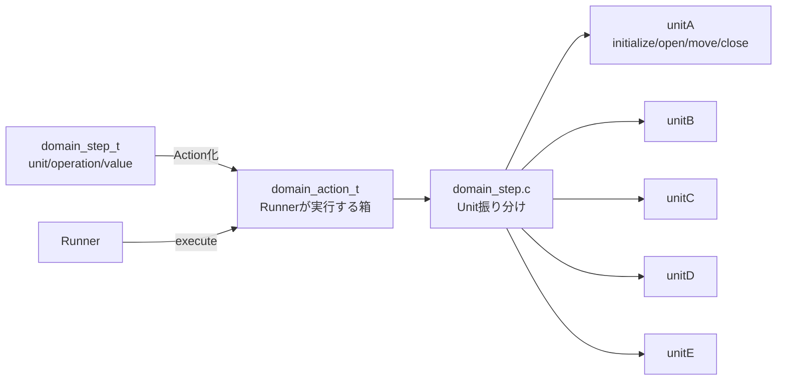
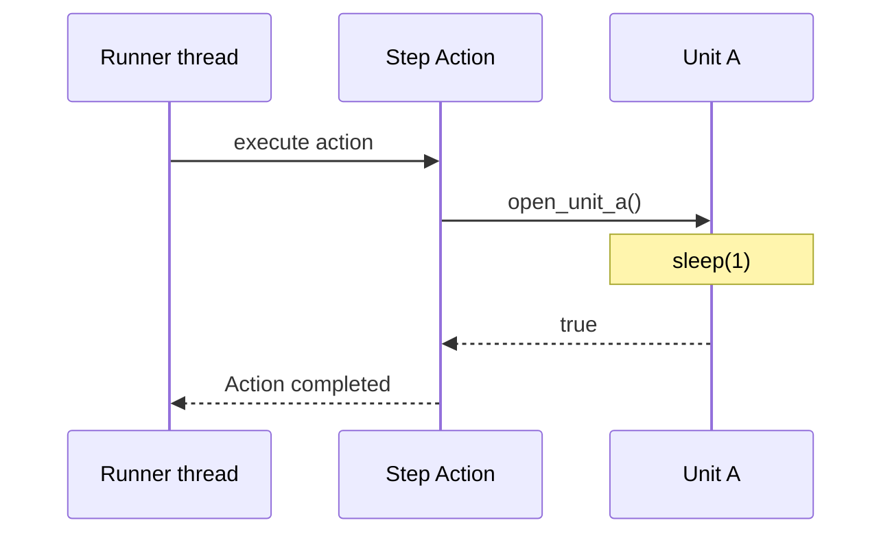

# unit

部品や機能モジュールに対する操作インターフェースを置く層です。

各Unitはモジュール単位でフォルダを分けて管理します。
このサンプルでは、Unit AからUnit Eまでを同じインターフェースで用意し、各関数はUnit名、関数名、引数を `printf` で出力します。

## この層の目的

`unit` は、`domain` の `Step` から呼ばれる実行先です。
`Step` は「何をしたいか」を表し、`Unit` は「その操作を実際にどう実行するか」を受け持ちます。

実際のプロジェクトでは、Unit Aがセンサ、Unit Bがモーター、Unit Cがバルブのように、
部品や機能モジュールごとにフォルダを分ける想定です。
このサンプルではまだ実機操作は行わず、関数が呼ばれたことを `printf` で確認できる形にしています。

```text
unit/
├── unitA/
│   ├── include/
│   ├── src/
│   └── test/
├── unitB/
├── unitC/
├── unitD/
└── unitE/
```

各Unitフォルダの中は、次の構成にしています。

```text
unitA/
├── include/
│   └── unit_a.h
├── src/
│   └── unit_a.c
└── test/
    └── test_unit_a.c
```

`include` には、外部へ公開する関数宣言や型定義を置きます。
`src` には、Unitの実装を置きます。
`test` には、そのUnitを単体で呼び出す確認用コードを置きます。

各Unitは次の操作を公開します。

- 初期化
- 終了
- 状態取得
- 移動
- 開く
- 閉じる

## 公開している操作

各Unitは、現時点では同じ形の関数を持っています。
Unit Aの場合は次のような名前です。

```c
bool initialize_unit_a(void);
bool terminate_unit_a(void);
bool get_unit_a_status(unit_a_status_t *status);
bool move_unit_a(int position);
bool open_unit_a(void);
bool close_unit_a(void);
```

Unit Bなら `initialize_unit_b()`、Unit Cなら `initialize_unit_c()` のように、
操作を表す動詞を先頭に置き、対象のUnit名を後ろに付けます。
戻り値は `bool` にして、呼び出し元が成功または失敗を判断できる形にしています。
状態取得のように値を返したい関数は、戻り値を `bool` のままにするため、
出力引数へ結果を書き込みます。

`move` だけは引数を持ちます。
現在は `position` という整数を受け取り、その値を `printf` で表示します。
将来的には、この値がモーター位置、搬送量、設定値などに置き換わるイメージです。

`move` に負の値を渡した場合は、操作失敗として `false` を返します。
これは、domain層のRunnerがUnit失敗を検出してERRORへ遷移する流れを確認するための条件です。

## 実装の読み方

たとえば Unit A の `move_unit_a()` は、今は次のような動きだけをします。

```text
[unitA] move_unit_a(position=100)
```

これは実機を動かしているわけではありません。
ワークフローを追うときに、「このStepからUnit Aのmoveが呼ばれた」と分かるようにするための仮実装です。

負の値を渡した場合は、次のように失敗を表すログになります。

```text
[unitA] move_unit_a(position=-1) -> false
```

また、各Unitは簡単な状態を内部に持っています。
初期化すると `READY`、開くと `OPEN`、移動すると `MOVING`、閉じると `CLOSED` のように状態が変わります。
現時点では状態遷移の厳密なチェックはしていません。
これは、まずフォルダ構成と呼び出しの流れを理解することを優先しているためです。

## 今後の拡張イメージ

このサンプルが進むと、`domain` の `Step` から各Unitの関数を呼び出す形になります。

```text
Step: Unit Aをopenする
  -> open_unit_a()

Step: Unit Bをmoveする
  -> move_unit_b(position)
```

実際のプロジェクトでは、Unitの中でさらにDriver、通信、I/Oなどを呼び出すことがあります。
ただし、`domain` から見ると「Unitに命令を渡す」だけに見えるようにしておくと、
ワークフロー制御と部品操作をきれいに分けられます。

## StepからUnitまでの流れ



UnitはScenarioやSequenceを知りません。
Unitは、自分に対する操作関数が呼ばれたら、その処理を行って `true` または `false` を返します。

## Unit操作のタイミング

現在のUnit操作は同期処理です。
各操作関数の中で1秒待ち、完了後に戻ります。


