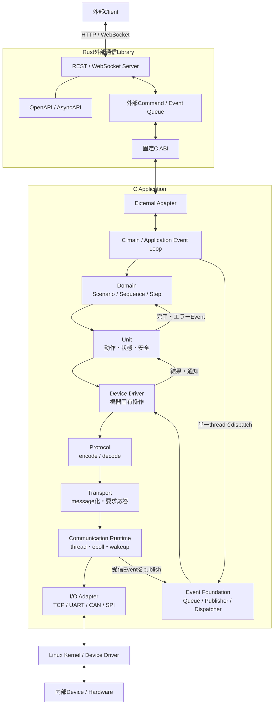
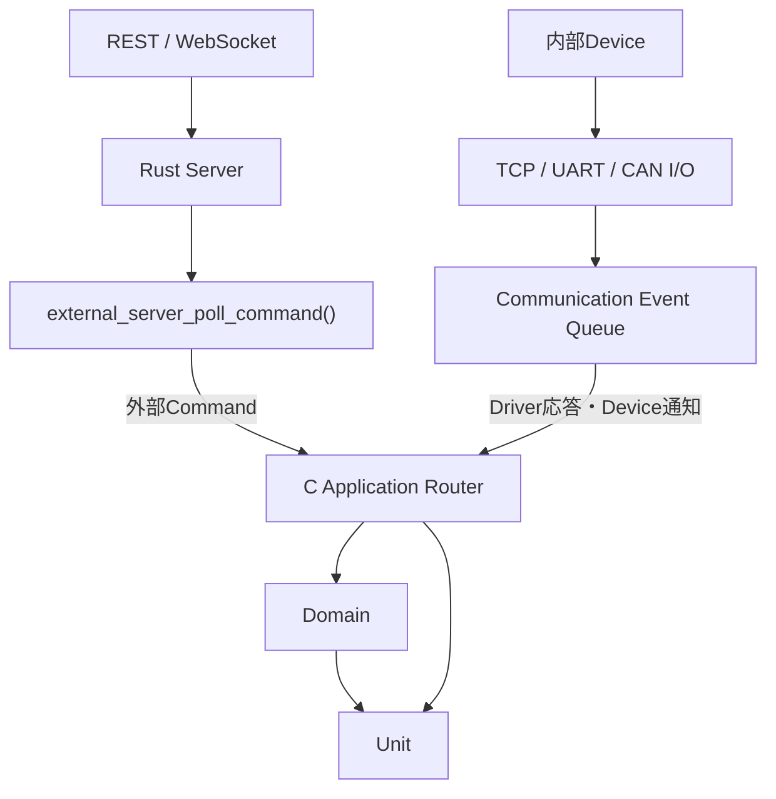
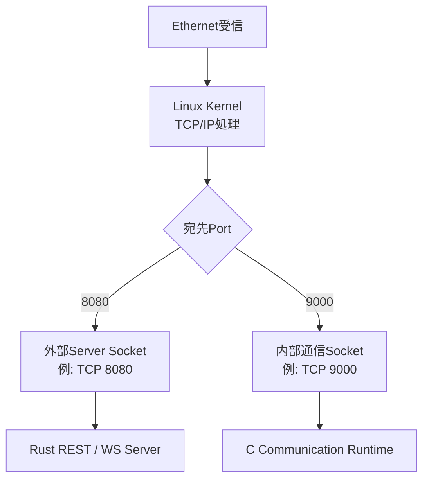
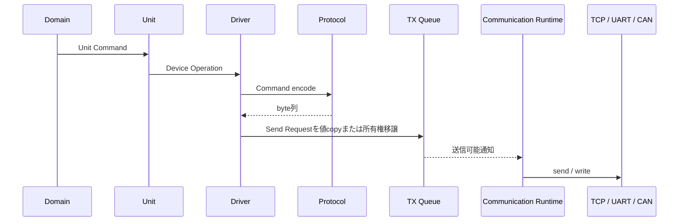
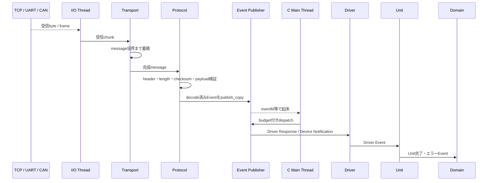
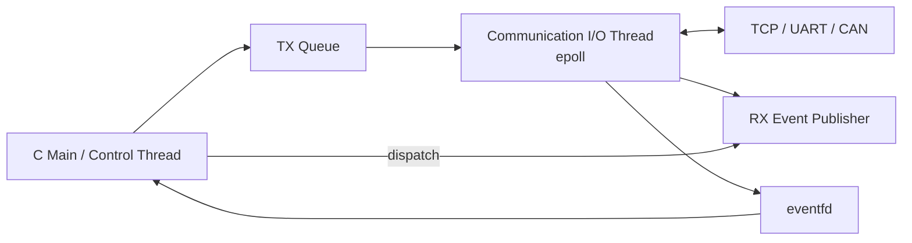

# Unit・内部通信アーキテクチャ

## 目的

本書は、Domainから命令を受けるUnitと、その下位に置くDriver、Protocol、
Transport、I/Oおよび通信Runtimeの責務を定義する。

本システムではCをApplicationの主体とし、Cの`main`がDomain、Unit、内部通信、
外部通信ライブラリの起動と終了を管理する。REST、WebSocket、OpenAPI、AsyncAPIを
扱う外部通信ServerはRustで実装するが、Cから固定C ABIを通して利用する。

## 全体構成



依存方向は原則として上位から下位へ向ける。受信結果は下位層から上位層を直接
呼び上げるのではなく、Event Queueを経由してCのApplication thread上で配送する。

## 各層の責務

| 層 | 主な責務 | 扱わないもの |
| --- | --- | --- |
| Domain | Scenario、Sequence、Step、Unit命令順序 | Socket、UART、機器固有byte列 |
| Unit | 製品として意味のある動作、状態、安全条件、timeout | IP、Port、Protocol frame |
| Driver | 機器固有Command、物理値変換、応答と要求の対応 | DomainのWorkflow、REST |
| Protocol | messageのencode/decode、opcode、length、checksum | I/O、thread、再接続 |
| Transport | message境界、要求応答、timeout、retry、分割・再構成 | 機器の業務的な意味 |
| Communication Runtime | 送受信thread、`epoll`、wakeup、shutdown | Protocol固有Commandの解釈 |
| I/O Adapter | `socket`、`read`、`write`、`termios`、SocketCANなど | Unit状態、Domain状態 |
| Event Foundation | 値copy Queue、同期Dispatcher、Timer、Metrics | thread生成、I/O、非同期handler |

単純なGPIOやPWM機器では、DriverからHALまたはI/O Adapterを直接利用してよい。
すべての機器へProtocolやTransportを形式的に挟む必要はない。

## 推奨フォルダ構成

```text
src/
├── main.c
├── application/
│   ├── application.c
│   ├── application_event_loop.c
│   └── application_composition.c
├── external/
│   ├── include/external_adapter.h
│   ├── src/external_adapter.c
│   └── tests/
├── domain/
├── unit/
│   ├── architecture.md
│   ├── include/
│   │   ├── unit_motor.h
│   │   └── unit_sensor.h
│   ├── src/
│   │   ├── unit_motor.c
│   │   └── unit_sensor.c
│   └── tests/
├── driver/
│   ├── motor/
│   │   ├── include/driver_motor.h
│   │   ├── src/driver_motor.c
│   │   └── tests/
│   └── sensor/
│       ├── include/driver_sensor.h
│       ├── src/driver_sensor.c
│       └── tests/
├── communication/
│   ├── runtime/
│   │   ├── include/communication_runtime.h
│   │   ├── src/communication_runtime.c
│   │   ├── src/communication_io_worker.c
│   │   ├── src/communication_tx_queue.c
│   │   └── src/communication_wakeup_linux.c
│   ├── protocol/
│   │   ├── motor/
│   │   │   ├── include/protocol_motor.h
│   │   │   ├── src/protocol_motor_encode.c
│   │   │   ├── src/protocol_motor_decode.c
│   │   │   └── tests/
│   │   └── sensor/
│   ├── transport/
│   │   ├── include/transport.h
│   │   ├── src/transport_framer.c
│   │   ├── src/transport_request_table.c
│   │   ├── src/transport_timeout.c
│   │   └── tests/
│   └── io/
│       ├── tcp/
│       │   ├── include/io_tcp.h
│       │   └── src/io_tcp_linux.c
│       ├── uart/
│       │   ├── include/io_uart.h
│       │   └── src/io_uart_linux.c
│       ├── can/
│       └── spi/
└── platform/
    └── linux/
        ├── include/
        └── src/
```

これは完成時の責務配置を示す。小規模な初期実装では、機能が一つしかない階層を
無理に細分化せず、責務が増えた時点で同じ境界に沿って分割する。

## 外部入力と内部入力

外部・内部の区別をmessage内容、IPアドレス、Port番号からUnitが推測してはならない。
どの受信APIからApplicationへ入ったかによって入口を確定する。



外部CommandはDomainへ渡し、内部Deviceからの応答や通知は対応するDriverまたはUnitへ
配送する。Unitは通常、その動作要求がREST由来かWebSocket由来かを知らない。

外部応答先との対応はDomainまたはExternal Adapterが`request_id`で管理する。
HTTP connectionやWebSocket sessionの識別子をUnitまで渡さない。

## Linuxによる通信の振り分け

TCPまたはUDPでは、Linux KernelがProtocol、IPアドレス、Portなどを基に対象Socketへ
packetを振り分ける。



Linuxが判断するのはSocketまでである。1本のSocket内に複数種類のmessageが流れる場合、
message headerの`message_type`、`device_address`、`request_id`などをProtocol層で
解析し、Applicationが対応するDriverへ振り分ける。

UARTにはIPアドレスやTCP/UDP Portはない。Linuxでは`/dev/ttyS0`、
`/dev/ttyUSB0`など、C Applicationが開いたdevice fileによって経路が決まる。
CANではCAN ID、SPIではcontrollerとChip Selectなど、通信方式ごとの識別方法を使う。

## 内部通信の送信経路

UnitやDriverのhandler内でblockingする`send()`や`write()`を直接実行しない。
送信要求はQueueへ積み、Communication RuntimeのI/O threadが実際の送信を行う。



送信Queueが満杯の場合に、再試行、Command拒否、Unitのfault遷移のどれを選ぶかは
製品要件として明示する。

## 内部通信の受信経路

TCPはstreamであり、1回の`recv()`と1 messageは一致しない。Transportは受信byteを
蓄積し、headerやlengthを基に完全なmessageへ再構成する。



受信threadからDriver、Unit、Domainの状態を直接変更しない。受信threadはdecode済みの
結果をEvent Queueへ積むまでとし、状態遷移は単一のApplication threadへ直列化する。

## Threadモデル

Linux上では、接続ごとにthreadを作るのではなく、まずは`epoll`を使う単一I/O threadを
基本とする。通信量や優先度分離の要件が明確になった場合のみthreadを分割する。



Communication Runtimeは以下を所有する。

- I/O threadの生成、停止要求、join
- `epoll`対象の登録と解除
- TX Queueのdrain
- Socket切断と再接続方針
- `eventfd`などによるApplication threadの起床
- shutdown時の送受信停止順序

## Event Foundationの適用

既存のEvent Foundationは受信結果を上位へ配送する仕組みとして利用できる。

- `ut_event_publisher_publish_copy()`で小さな結果payloadを値copyする
- Publisherへlock/unlock callbackを設定し、I/O threadからpublish可能にする
- `ut_event_publisher_dispatch()`はCのApplication threadだけから呼ぶ
- handlerは短時間で終了し、blocking I/Oを行わない
- budgetを指定し、Eventが多い場合も他のApplication処理へ制御を戻す
- Queue満杯、未購読、Contract違反をMetricsで観測する

Event Foundationは意図的に次の機能を所有しないため、これらを
`foundation/event`へ追加しない。

- thread、Mutex、Semaphoreの生成
- Socket、UART、CAN、SPIのopenと送受信
- `epoll`、再接続、通信shutdown
- 非同期handler実行
- Application threadを起床するOS固有機構

これらは`communication/runtime`またはApplication Adapterの責務とする。
Event Foundation本体の変更は現時点では不要である。

小さな固定長応答や状態通知にはPublisherを使う。大きな可変長payloadを非同期配送する
場合は、既存`memory-buffer`へpayloadを保存し、Event Buffer Envelopeでhandleの
所有権を移譲する。受信bufferを指すpointerをEventへそのまま格納してはならない。

## Rust外部通信Libraryとの境界

Cの`main`がRust Libraryのライフサイクルを次のような固定C ABIで管理する。

```c
external_server_t *external_server_create(
    const external_server_config_t *config);

external_result_t external_server_start(external_server_t *server);

external_result_t external_server_poll_command(
    external_server_t *server,
    external_command_t *command);

external_result_t external_server_publish_event(
    external_server_t *server,
    const external_event_t *event);

void external_server_stop(external_server_t *server);
void external_server_destroy(external_server_t *server);
```

FFI境界では次を守る。

- Rustの型、`Future`、JSON objectをCへ公開しない
- C ABIでは固定幅整数と明示的なlengthを使用する
- RustとCの間でCommandとEventを値copyする
- Cから渡されたpointerをRustが呼出し後も保持しない
- RustからC worker threadへ非同期callbackしない
- Queue full、未起動、停止中などを明示的なerror codeで返す
- ABI versionを公開し、互換性を検査する

## 構成情報

IPアドレス、Port、UART device path、baud rate、CAN interfaceなどはUnitやDriverへ
埋め込まず、Application compositionで設定して各層へ注入する。

```text
外部REST/WS:
  listen_address = 0.0.0.0
  listen_port = 8080

内部TCP Device:
  remote_address = 192.0.2.10
  remote_port = 9000

内部UART Device:
  device_path = /dev/ttyS0
  baud_rate = 115200
```

Unitはこれらの通信設定を知らず、Driverの型付きAPIだけを利用する。

## 設計ルール

- Cの`main`がApplication、Rust Library、通信Runtimeのライフサイクルを所有する
- 外部REST/WS CommandはExternal AdapterからDomainへ入力する
- 内部Deviceの応答と通知はCommunication RuntimeからEvent Queueへ入力する
- Unitは外部・内部という通信経路ではなく、型付きCommandとDriver Eventを扱う
- 受信threadからUnitまたはDomainの状態を直接変更しない
- Protocolはencode/decodeに限定し、I/Oやthreadを所有しない
- blocking I/OはApplication Event handler上で実行しない
- Queueへ渡すpayloadの所有権と寿命をAPIごとに明記する
- Queue満杯、切断、timeout、decode失敗時の製品動作を明示する
- 通信方式やOS固有処理をUnitへ持ち込まない
